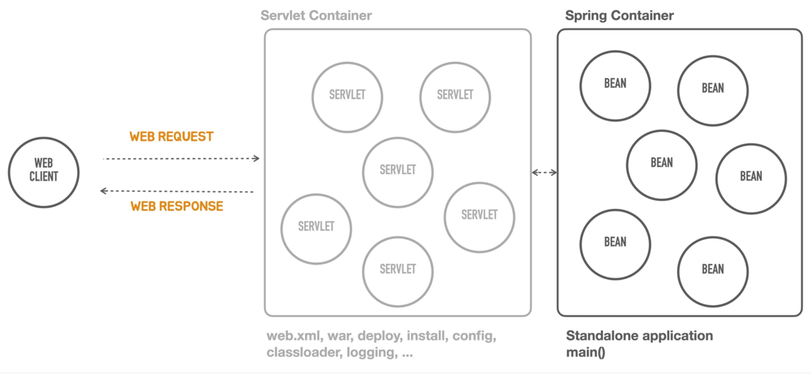

# SpringBoot 강의 정리


## 스프링 부트 살펴보기

### 1. 스프링 부트 소개

> 스프링 부트는 **스프링을 기반으로** 실무 환경에 사용 가능한 수준의 **독립 실행형 어플리케이션**을 복잡한 고민없이 빠르게 
  작성할 수 있게 도와주는 여러가지 도구의 모음이자 스프링을 확장하고 있는 라이브러리를 의미한다. 

<br>

### 2. 스프링 부트 핵심 목표

1. 자동 설정을 지원해 즉시 적용 가능한 기술 조합을 제공하고, 필요에 따라 원하는 방식으로 손쉽게 변경이 가능하다.
2. 프로제트의 필요한 비기능 기술 제공 (e.g. 내장 서버, 보안, 메트릭, 상태 체크, 외부 설정 방식)
3. 코드 생성이나 XML 설정을 필요로 하지 않음.

<br>

### 3. Containerless



1. 서버리스(serverless) 와 유사하다. 서버리스는 서버에 관한 설치 관리를 신경쓰지 않고 운영 관리가 가능한 것을 의미한다.
2. 서버를 만드는 것은 웹 컴포넌트를 만드는 작업이다. 정적인 정보일 경우 웹서버로 관리하고, 동적인 정보를 전달할 경우에 웹 컴포넌트를 생성한다.
이 웹 컴포넌트는 웹 컨테이너(web container) 안에서 관리되며, 웹 컴포넌트의 매핑 정보를 통해 요청을 할당하는 역할을 한다. 
  자바 진영에서는 웹 컴포넌트를 의미하는 것이 서블릿(servlet) 이며, 웹 컨테이너는 서블릿 컨테이너를 의미한다.
3. 스프링 컨테이너는 서블릿 컨테이너 후방에 위치하며 서블릿의 요청을 넘겨 받아 비즈니스 로직을 담당하는 빈을 관리한다. 
4. 스프링을 통해 웹 서버를 띄우기 위해서는 web.xml 에 설정하고 war 확장자로 빌드, 서버 설정, 로깅 등등 _실행하기 위한 사전작업이 많이 필요했다._
5. 여기서 말하는 컨테이너리스(containerless) 는 서블릿 컨테이너가 필요는 하지만 _설치, 설정, 관리하는데 개발자가 학습하고 별도의 시간을 들이지 않아도 서버를
  구성할 수 있도록 지원하는 것을 의미한다._
6. 별도의 web.xml, war, install, config, classloader 를 설정하지 않아도 스프링부트를 통해 스프링 컨테이너에서 자동 설정되어 실행이 된다.
7. 스프링 부트를 통해 **main 메서드를 실행하기만 하면 자동 설정 및 실행 가능한 환경**을 `Standalone application` 이라 부른다.

<br>

### 4. Opinionated (주장이 강한 = 내가 다 정해줄게 일단 개발만 해)

1. 스프링 프레임워크의 설계 철학은 `극단적인 유연한 추구`, `다양한 관점 수용`, `Not opinionated`, `수많은 선택지를 다 포용` 등이 있다. 
   하지만, 개발자가 모든 선택지에 관한 고민과 시간을 투자해야 하는 단점이 있었다.
2. 스프링 부트의 설계 철학은 `Opinionated` 이다. 우선 best practice 의 자동 설정을 제공하고 이후에 커스터마이징이 가능한 형태이다.
   (일단 정해주는 대로 빠르게 개발하고 고민은 나중에)
3. 스프링 부트가 대표적으로 제공하는 것은 `사용 기술`과 `의존 라이브러리 결정`이다. 업계에서 검증된 스프링 프로젝트 사용 버전을 제공하고,
   스프링에 적용하는 방식(DI 구성)과 디폴트 설정 값(e.g. TransactionManager, SesseionFactory...)을 제공한다.
4. 스프링은 또한 유연한 확장을 제공한다. 스프링 부트에서 내장된 구성 외에 유연하게 구성을 커스터마이징이 가능하고,
   스프링 부트처럼 기술과 구성을 간편하게 제공하는 나만의 모듈 작성이 가능하다.

<br>

### 5. 스프링 부트의 이해

1. 스프링 부트가 어떤 스프링의 기술을 어떻게 활용하고 있는지 알고 있어야 하고, 선택한 기술, 자동 구성, 디폴트 설정이 어떤 것이 있는지 확인할 수 있어야 한다.
   **스프링 부트 이용한 개발의 오해는 스프링을 잘 몰라고 개발해도 되고, 스프링 부트가 직접적으로 보여주지 않는 것을 몰라도 된다는 것이다.**
2. 필요할 때 부트의 기본 구성을 수정하거나, 활장할 수 있다. 또한 나만의 스프링 부트 모듈을 만들어서 활용할 수 있다.

<br>


### 6. 강의 목표

1. 스프링 부트로 만든 스프링 애플리케이션의 기술과 구성 정보 확인
2. 적용 가능한 설정 항목을 파악할 수 있다.
3. 직접 만든 빈 구성 정볼르 적용하고, 그에 따른 변화를 분석할 수 있다.
4. 스프링 부트의 기술을 꼼꼼히 살펴볼 수 있다.

```
프레임워크를 효과적으로 재사용하기 위해서는 프레임워크의 최종 모습 뿐만 아니라 현재의 모습을 띠게 되기까지 진화한 과정을 살펴 보는 것이 가장 효과적이다.
프레임워크의 진화 과정 속에는 프레임워크의 구성 원리 및 설계 원칙, 재사용 가능한 컨텍스트와 변경 가능성에 관련된 다양한 정보가 들어 있기 때문이다.
- 조영호 (프레임워크 3부)
```

<br>

