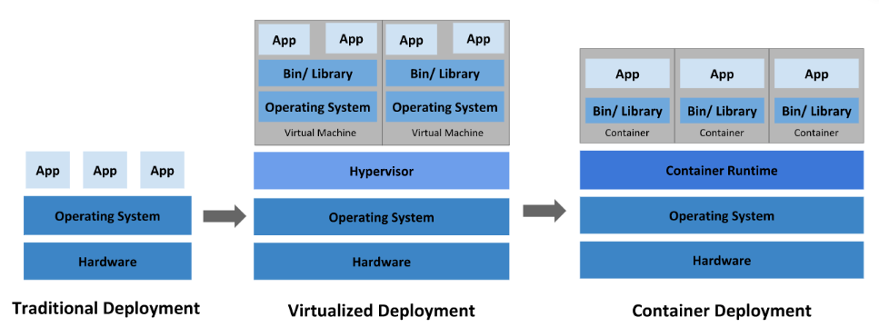
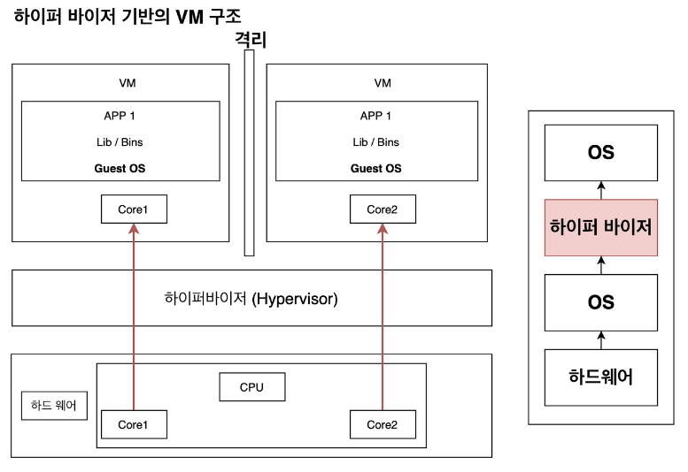
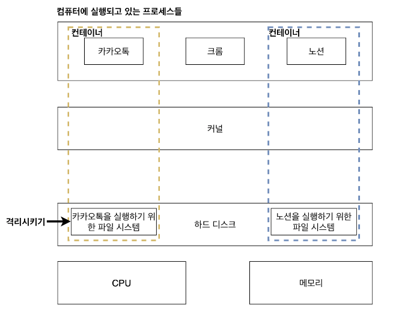

# 가상화(visualization) & 컨테이너(container)

- 출처 : https://itwiki.kr/w/%EC%BB%A8%ED%85%8C%EC%9D%B4%EB%84%88_%EA%B0%80%EC%83%81%ED%99%94

## 1. 가상화(visualization)

1. 가상화(Virtualization)
   - 소프트웨어를 사용해 <u>하나의 물리적인 리소스(예: 서버, 스토리지, 네트워크)를 여러 가상 환경으로 분할하여 사용하는 기술</u>이다.
   - 가상화의 주요 목표는 <u>리소스의 효율적인 활용</u>, <u>유연성</u>, <u>안정성 및 비용 절감</u>이다.

2. `하이퍼바이저(Hypervisor)`
   1. 호스트 머신에서 가상 머신(VM)을 생성하고 실행하는 데 사용됩니다.</u> 하이퍼바이저는 <u>가상 머신의 생성</u>, <u>할당된 리소스의 관리</u>, <u>가상 머신 간의 격리</u> 등을 담당한다.
   2. 하이퍼바이저는 두 가지 주요 유형으로 분류된다.
      - `Bare-metal` : 하이퍼바이저는 호스트 머신에 직접 설치
      - `Hosted` : 하이퍼바이저는 호스트 운영 체제 위에서 실행

3. `가상 머신(VM)`
   - 가상 머신은 물리적인 컴퓨터와 유사한 `독립적인 가상 환경`이다.
   - 각 가상 머신은 가상 하드웨어(프로세서, 메모리, 디스크 등)와 운영 체제를 가지고 있으며, 애플리케이션과 서비스를 실행한다.
   - 각 가상 머신은 <u>서로 독립적으로 운영</u>되며, 호스트 운영 체제 또는 다른 가상 머신과는 격리된다.

## 2. 가상 머신 & 컨테이너 차이 정리

|   기능    |         가상 머신         |          컨테이너           |
|:-------:|:---------------------:|:-----------------------:|
| 가상화 수준  |          H/W          |           OS            |
| 리소스 사용량 |          높음           |           적음            |
|   성능    |        제한된 성능         |         성능 제한 x         | 
|   보안성   | 가상머신간 완전한 격리로 높은 보안성	 | 프로세스 수준의 격리로 비교적 낮은 보안성 

## 3. 가상 머신과 컨테이너의 차이

1. 공통점
   1. 가상화(Virtualization)와 컨테이너 기술(Containerization)은 둘 다 <u>IT 환경에서 리소스의 효율성과 유연성을 높이기 위해 사용되는 기술</u> 이다. 
2. 차이점
   1. `레벨`
      2. 가상화
         1. 가상화는 <u>하드웨어 레벨</u>에서 이루어지는 반면, 컨테이너 기술은 <u>운영 체제 또는 호스트 머신의 운영 체제 레벨</u>에서 이루어진다.
         2. 가상화는 `하이퍼바이저(Hypervisor)`를 사용하여 가상 머신(VM)을 생성하고 독립적인 운영 체제를 실행한다. 
            반면에 컨테이너는 <u>호스트 머신의 운영 체제 커널을 공유</u>하고, 각 컨테이너는 격리된 프로세스 공간을 가지며 <u>필요한 리소스만을 사용</u>한다. 
   2. `격리 수준`
      - 가상화는 각 <u>가상 머신이 완전히 격리</u>되어 <u>독립된 운영 체제를 가지고 동작</u>합니다. 즉, 가상 머신 간에는 서로 영향을 주지 않다.
      - 반면에 컨테이너는 <u>호스트 운영 체제의 커널을 공유</u>하므로 더 가볍고 빠르며 <u>격리 수준이 상대적으로 낮다.</u>
        하지만 `네임스페이스`, `제한된 리소스 할당`, `시그널 처리` 등의 기능을 제공하여 컨테이너 간에 격리를 제공한다. 
   3. `시작 시간 및 성능`
      1. 가상화는 <u>완전한 운영 체제를 가상화</u>해야 하므로 가상 머신을 시작하는 데 시간이 걸리고, <u>메모리 및 프로세싱 리소스도 더 많이 소비</u>한다.
      2. 반면에 컨테이너는 <u>호스트 운영 체제의 커널을 공유</u>하고, 컨테이너 이미지에 포함된 애플리케이션 및 종속성만을 실행하므로 시작 시간이 빠르고 자원 소비가 적다.

## 4. 하이퍼 바이저 & 컨테이너 차이 이미지

`하이퍼 바이저`

- 이미지 출처 : https://victoria-k.tistory.com/entry/0-Docker%EC%97%90-%EB%8C%80%ED%95%B4-%EC%95%8C%EC%95%84%EB%B4%85%EC%8B%9C%EB%8B%A4

`컨테이너`

- 이미지 출처 : https://victoria-k.tistory.com/entry/0-Docker%EC%97%90-%EB%8C%80%ED%95%B4-%EC%95%8C%EC%95%84%EB%B4%85%EC%8B%9C%EB%8B%A4

### References

- [VM(가상머신) VS Container(컨테이너)](https://hazel-developer.tistory.com/242)
- [Docker에 대해 알아봅시다](https://victoria-k.tistory.com/entry/0-Docker%EC%97%90-%EB%8C%80%ED%95%B4-%EC%95%8C%EC%95%84%EB%B4%85%EC%8B%9C%EB%8B%A4)
