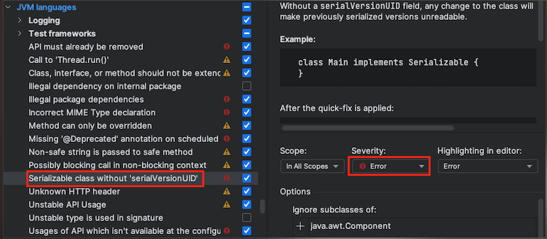

## 자바 SerialVersionUID?

### 1. SerialVersionUID

1. SUID 는 직렬화와 역직렬화 과정에서 값이 서로 맞는지 확인한 후에 처리한다.(맞지 않다면 `InvalidClassException` 를 반환한다.)
2. 자바의 직렬화 스펙 정의를 살펴보면 SUID 값은 필수가 아니며 **선언되어 있지 않으면 클래스의 기본 해시값을 사용**한다.
   (이 값들은 클래스의 이름, 생성자 등과 같이 클래스의 구조를 이용해서 생성)

`필드 추가 후 역직렬화가 불가능함을 확인하는 테스트 코드`
```java
import static org.assertj.core.api.Assertions.assertThat;

class DefaultSerialEntityTest {
    
    @Test
    @DisplayName("DefaultSerialEntity 에 필드를 추가할 경우 다른 역직렬화 값을 반환하여 예외를 반환한다")
    void defaultSerializeWhenAddField() throws IOException, ClassNotFoundException {
        //given, when
        // phoneNumber 필드 추가 이전 직렬화 값
        String serializedByteStrBeforeFieldAdd = "rO0ABXNyACtjb20uY29vcGVyLnNlcmlhbGl6YWJsZS5EZWZhdWx0U2VyaWFsRW50aX" +
                "R54Lm3/1et2ggCAANMAAlwcmVzc05hbWV0ABJMamF2YS9sYW5nL1N0cmluZztMAAxyZXBvcnRlck5hbWVxAH4AAUwABXRpdGxlc" +
                "QB+AAF4cHQAC3ByZXNzTmFtZTExdAAOcmVwb3J0ZXJOYW1lMTF0AAbsnbTrpoQ=";

        //then
        assertThatThrownBy(() -> SerializableUtil.<DefaultSerialEntity>deSerializeMethod(serializedByteStrBeforeFieldAdd))
                .isInstanceOf(InvalidClassException.class);
    }

}

```

<br>

### 2. 클래스의 기본 해시값을 통한 SerialVersionUID 의 문제

1. 클래스의 구조가 변경되었을 때 오류가 발생한다.
   - 예시: `멤버 변수 타입 변경`, `멤버 변수 삭제`
2. ***클래스의 기본 해시값을 통한 SerialVersionUID 의 문제***
    - 프레임워크 또는 라이브러리에서 제공하는 클래스의 객체도 버전업을 통해 ***SerialVersionUID 가 변경될 경우가 있으므로*** 예상하지 못한 오류가 발생할 수 있다.

<br>

### 🚨 3. SerialVersionUID 는 되도록이면 개발자가 직접 관리하자!!
- intellij 에서는 serialVersionUID 자동 생성을 제공하는 옵션을 제공하기 때문에 꼭 옵션을 추가하도록 하자!! (이왕이면 경고까지 띄우주도록 하자)
- (**File > Settings > Serializable class without ‘serialVersionUID’**)



`필드 추가 후 정상적으로 역직렬화가 되는 것을 확인하는 테스트 코드`

```java
import org.assertj.core.api.Assertions;
import org.junit.jupiter.api.DisplayName;
import org.junit.jupiter.api.Test;

import java.io.IOException;

class SerialUIDEntityTest {

    @Test
    @DisplayName("serialVersionUID 을 선언하면 클래스 정보 관계없이 serialVersionUID 기준으로 직렬화된다.")
    void SerialVersionUID() throws IOException, ClassNotFoundException {
        //given, when
        // phoneNumber 필드 추가 이전 직렬화 값 : new SerialUIDEntity("title222", "pressName222", "reporter222");
        String serializedByteStrBeforeFieldAdd = "rO0ABXNyACdjb20uY29vcGVyLnNlcmlhbGl6YWJsZS5TZXJpYWxVSURFbnRpdHmdPCX" +
                "tUpN9UQIAA0wACXByZXNzTmFtZXQAEkxqYXZhL2xhbmcvU3RyaW5nO0wADHJlcG9ydGVyTmFtZXEAfgABTAAFdGl0bGVxAH4AAXh" +
                "wdAAMcHJlc3NOYW1lMjIydAALcmVwb3J0ZXIyMjJ0AAh0aXRsZTIyMg==";

        //then
        Assertions.assertThat(SerializableUtil.<SerialUIDEntity>deSerializeMethod(serializedByteStrBeforeFieldAdd))
                .isInstanceOf(SerialUIDEntity.class);
    }

}
```

## 4. Serialazable 의 권장하지 않지만 사용할 때는 주의해서 사용하자.

1. 악의적인 공격 요소가 많다.
   - `readObject` : 해당 메서드는 클래스 패스에 있고 Serializable interface 를 구현한 모든 타입을 생성할 수 있기 때문이다.
    - `역직렬화 필터링` 을 사용해 안전하다고 판단되는 `클래스 화이트 리스트` 와 같은 목록을 역직렬화를 하는데 제공해야 한다.
## References

- [[Madplay] 자바 직렬화: SerialVersionUID는 무엇일까?](https://madplay.github.io/post/java-serialization-advanced)
- [[Madplay] 자바 직렬화: 자바 직렬화를 사용할 때 고민하고 주의할 점](https://madplay.github.io/post/why-java-serialization-is-bad)
- [Intellij- serialVersionUID 자동생성하기](https://androowl.tistory.com/50)
