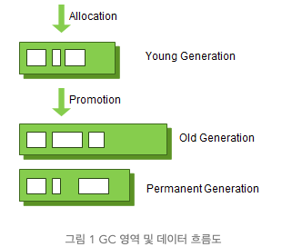
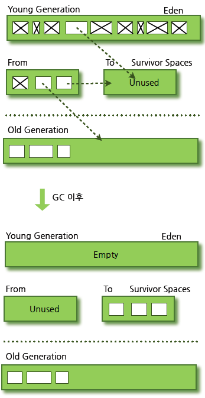
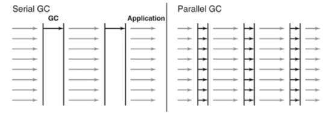
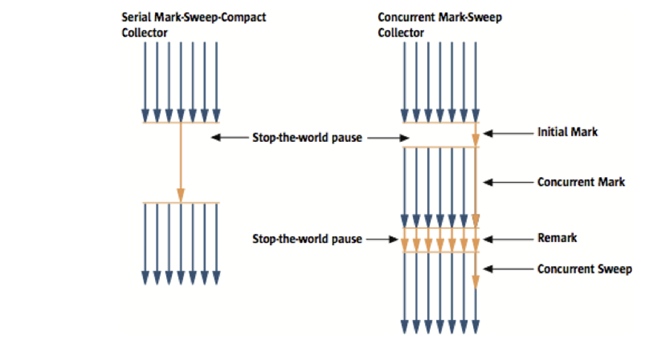
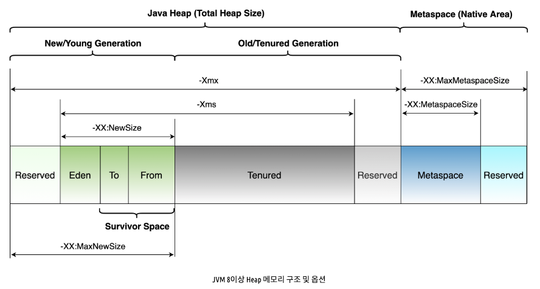

# Java - Garbage Collector(GC)

## 1. Garbage Collector

### **(1) Garbage Collector ??**

1. 더 이상 사용되지 않는 객체를 식별하게 제거해 <u>메모리를 회수하는 역할</u>을 하며, <u>메모리 관리를 자동화</u>하기 위해 사용하는 기능이다.
2. 이는 메모리에 관련한 작업에 관한 <u>개발자의 부담을 줄일 수 있다.</u> 


### **(2) GC 장점**
1. <u>명시적인 메모리 관리를 통한 버그를 줄이고</u>, <u>자동 메모리 회수를 통해 개발자의 부담을 줄인다.</u>

### **(3) GC 단점**

1. `stop-the-world`
   - GC 실행을 위해 JVM 이 애플리케이션을 중단하는 과정을 말한다.
   - stop-the-world 가 발생하면 <u>GC 를 실행하는 쓰레드를 제외한 나머지 쓰레드는 모두 작업을 멈춘다.</u>
   - GC 작업을 완료한 이후에 중단했던 작업을 다시 시작한다.
   - 이를 해결하기 위해 `GC 튜닝` 이 필요한다. GC 튜닝은 <u>stop-the-world 시간을 줄이는 것이다.</u>

<br>

## 2. Garbage Collection

### (1) Generational Garbage Collection



- source : https://d2.naver.com/helloworld/1329

<br>

1. `weak generational hypothesis`: 가비지 컬렉터의 기반이 된 2가지 가설
   1. 대부분의 **객체는 금방 접근 불가능한 상태(`unrechable`)** 가 된다.
   2. **오래된 객체에서 젊은 객체로의 참조는 아주 적게 존재**한다.
2. `Young & Old Area`: `HotSpot VM` 에서 메모리 관리를 위해 구분한 영역
    1. `Young Generation Area`
       1. <u>새롭게 생성한 객체가 할당</u>되는 영역
       2. 대부분의 객체는 <u>대부분 접근 불가 상태가 되므로</u> Young 영역에서 생성되었다가 제거된다.
       3. 해당 영역에서 동작하는 GC 를 `Minor GC` 이다.
   2. `Old Generation Area`
      1. 접근 불가능한 상태가 되지 않아 <u>Young 영역에 오래 살아남은 객체가 이동하는 공간</u>
      2. Young 영역보다 크게 할당되며, <u>크기가 큰 만큼 GC는 적게 발생</u>한다.
      3. 해당 영역에서 동작하는 GC 를 `Major GC`(혹은 `Full GC`) 라 부른다.
   3. `Card table`
      1. Old 영역에는 **512byte 의 덩어리(chunk) 영역**이다.
      2. <u>Old 영역에 있는 객체가 Young 영역의 객체를 참조할 때마다 정보가 표시되는 공간</u>

<br>

## 3. Young 영역에 관한 GC



- source: https://d2.naver.com/helloworld/1329

### (1) Young 영역

1. Young 영역은 `Eden 영역`, `Survivor 영역(2개)` 로 나뉜다.
   - `Eden 영역` & `Survivor 영역`
     1. 새로 생성한 대부분 객체가 위치하는 영역
     2. GC 가 한 번 발생한 후 살아남은 객체는 `Survivor 영역` 중 하나로 이동한다.
     3. 하나의 `Survivor 영역`이 가득 차게 되면 살아남은 객체를 `다른 Survivor 영역`으로 이동한다.
     4. 계속해서 살아남은 객체는 `Old 영역`으로 이동한다.


### (2) bump-the-pointer

1. Eden 영역에 <u>할당된 마지막 객체를 추적한다.</u>
2. 객체가 생성되면 해당 객체 크기가 Eden 영역 크기를 확인하고 메모리에 할당한다.
3. Eden 영역에 저장하려면 <u>락(Lock)이 생성</u>되며, <u>`lock-contention` 으로 인해 성능이 낮아질 수 있는 문제</u>가 있다.

### (3) TLBs(Tread-Local Allocation Buffers)
   1. 각각의 Thread 마다 조그만 Eden 영역을 가질 수 있도록 하는 것이다.
   2. 자기가 가지고 있는 TLAB 에 접근하기 때문에 락(Lock) 문제업이 메모리 할당이 가능하다.

<br>

## 2. Old 영역에 관한 GC

- GC 의 방식에 따라 처리 절차가 다르다.
  1. Serial GC
  2. Parallel GC
  3. Parallel Old GC(Parallel Compacting GC)
  4. Concurrent Mark & Sweep GC(이하 CMS)
  5. G1(Garbage First) GC

### (1) Serial GC (-XX:+UseSerialGC)

1. `mark-sweep-compact 알고리즘`을 사용하는 GC 이다.
   1. Old 영역에 살아 있는 객체를 식별(`Mark`)
   2. 힙(heap)의 앞 부분부터 확인하여 살아 있는 것만 남긴다(`Sweep`)
   3. 각 객체들이 연속되게 쌓이도록 힙의 가장 앞 부분부터 채워서 객체가 존재하는 부분과 객체가 없는 부분으로 나눈다. (`Compaction`)
2. 적은 메모리와 CPU 코어 갯수가 적을 때 적합한 방식이다.
   - <u>데스크톱의 CPU 코어가 하나만 있을 때 사용</u>하기 위해 만든 방식이다.
   - <u>GC를 처리하는 스레드가 하나</u>이다.

### (2) Parallel GC (-XX:+UseParallelGC)

1. Serial GC 와 마찬가지로 `mark-sweep-compact 알고리즘`을 사용한다.
2. GC 를 처리하는 쓰레드가 여러 개이므로, Serial GC보다 빠른 객체 처리가 가능하다.
3. 메모리가 충분하고 코어의 갯수가 많을 때 유리하다.
4. `Throughput GC` 라 부르기도 한다.
5. <u>java 1.8 의 default GC 이다.</u>



### (3) Parallel Old GC(-XX:+UseParallelOldGC)

1. 앞서 설명한 Parallel GC와 비교하여 Old 영역의 GC 알고리즘만 다르다.
2. `Mark-Summary-Compaction 알고리즘`
   1. Summary 단계는 앞서 GC를 수행한 영역에 대해서 <u>별도로 살아 있는 객체를 식별한다는 점</u>에서 Mark-Sweep-Compaction 알고리즘의
      Sweep 단계와 다르다.

### (4) CMS GC (-XX:+UseConcMarkSweepGC)

1. `Low Latency GC` : `stop-the-world` 시간이 매우 짧다.
   1. `Initial Mark` 단계는 <u>클래스 로더에서 가장 가까운 객체 중 살아 있는 객체만 찾는 것으로 끝낸다.</u> (멈추는 시간이 매우 짧다.)
   2. `Concurrent Mark` 단계는 <u>방금 살아있다고 확인한 객체에서 참조하고 있는 객체들을 따라가면서 확인한다.</u>
2. 응답 속도가 매우 중요한 Application 에서 사용한다.



- source : https://d2.naver.com/helloworld/1329

### (5) G1 GC

1. <u>바둑판의 각 영역에 객체를 할당</u>하고 GC를 실행한다. <u>해당 영역이 꽉 차면 다른 영역에서 객체를 할당하고 GC를 실행한다.</u>
2. G1 GC 의 가장 큰 장점은 <u>성능</u> 이며, <u>java 11 의 default GC 이다.</u>  
3. `G1 GC`는 장기적으로 `CMS GC`를 대체하기 위해서 만들어 졌다.

<br>

### (6) Java default GC 확인 방법

1. Java -version 에 `-XX:+PrintCommandLineFlagsGC` 추가하여 확인
```
java -XX:+PrintCommandLineFlags -version`
```
- `-XX:+PrintCommandLineFlags` : JVM 에 대한 명령줄 플래그 정보를 출력하는 옵션 

2. default GC 확인
   - `-XX:+UseG1GC` 키워드를 보아 `G1GC GC` 를 사용함을 확인
```
-XX:ConcGCThreads=3
-XX:G1ConcRefinementThreads=13
-XX:GCDrainStackTargetSize=64
-XX:InitialHeapSize=268435456
-XX:MarkStackSize=4194304
-XX:MaxHeapSize=4294967296
-XX:MinHeapSize=6815736
-XX:+PrintCommandLineFlags
-XX:ReservedCodeCacheSize=251658240
-XX:+SegmentedCodeCache
-XX:+UseCompressedClassPointers
-XX:+UseCompressedOops 
-XX:+UseG1GC
openjdk version "18.0.1.1" 2022-04-22
OpenJDK Runtime Environment (build 18.0.1.1+2-6)
OpenJDK 64-Bit Server VM (build 18.0.1.1+2-6, mixed mode, sharing)
```

### (7) java memory model



### Tenured (Old Generation)

1. Survivor 영역의 객체가 minor gc 에서 살아 남아 다른 Survivor 영역으로 이동할 때 객체의 Age 가 증가하게 되는데
  일정 이상의 Age 가 되면 Tenured 영역으로 이동한다.
2. Promotion 이 되는 기준 Age 는 `-XX:MaxTenuringThreshold` 옵션을 통해 설정 가능하다.
   Java8 default value 는 `15` 이며, 설정 범위는 `0 <= value <= 15` 이다.

## References

- [[Naver D2] Java Garbage Collection](https://d2.naver.com/helloworld/1329)
- [[Geeks-for-geeks] Types of JVM Garbage Collectors in Java with implementation details](https://www.geeksforgeeks.org/types-of-jvm-garbage-collectors-in-java-with-implementation-details/)
- [[Oracle] Java Garbage Collection Basics](https://www.oracle.com/webfolder/technetwork/tutorials/obe/java/gc01/index.html)
