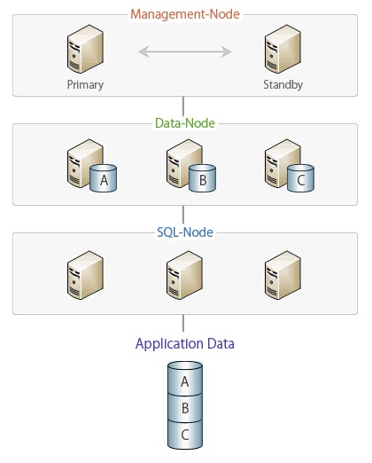
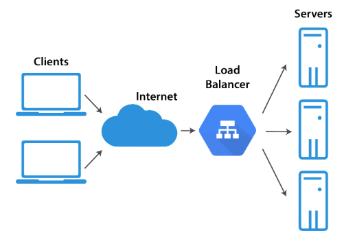

# 1. 가상 IP (Virtual IP)

## 1. 가상 IP 용어 및 장점

1. 가상 IP(Virtual IP) 는 **여러 대의 컴퓨터나 장치를 하나의 가상적인 IP 주소로 식별하는 기술**을 의미한다.
2. 가상 IP 는 **네트워크 유연성**과 **확장성을 향상**시키는 데 도움을 준다. 다수의 서버나 장치를 효츌적으로 관리하고, 고가용성과 부하 분산을 구현하기 위한 용도로 사용된다.
   - `로드밸런서` : 클라이언트와 통신에 사용되는 가상 IP를 제공하고 실제 서버로 트래픽을 전달한다.
   - `클러스터링 환경` : 여러 대의 서버가 클러스터를 구성하고, 클러스터링 소프트웨어는 가상 IP 를 통해 일부 노드에 접근한다. 
     일부 노드가 장애가 발생하면 다른 노드가 가상 IP를 이어받아 서비스를 계속할 수 있다.

 

`클러스터링 환경 이미지`

- 이미지 출처 : http://hanbiro.net/management/db_clustering.html

 

`로드 밸런서`

- 이미지 출처 : https://jaehoney.tistory.com/73

1. Load Balancer 종류
   - L4 Load Balancer
     - IP, Port 를 기준으로 부하를 분산하는 로드 밸런서.
   - L7 Load Balancer
     - IP, Port 외에도 `URI`, `Payload`, `Http Header,` `Cookie` 등의 내용을 기준으로 부하를 분산한다. (컨텐츠 기반 스위칭)
