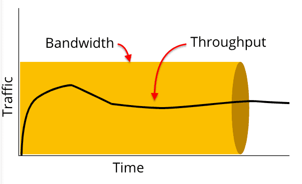

# 네트워크 대역폭

- 이미지 출처 : https://forum.huawei.com/enterprise/en/network-latency-vs-bandwidth-vs-throughput/thread/667250717280321536-667213852955258880

## 1. 네트워크 대역폭(Network Bandwidth)

1. 네트워크에서 초당 처리할 수 있는 데이터의 양을 의미한다.
2. 대역폭 단위는 `bps(bit per second)`, `Mbps(Megabits per second)`, `Gbps(Gigabits per second)`
   이다.

 

## 2. 대역폭과 쓰로풋(Throughput) 의 차이

1. 네트워크에서 초당 실제 처리되는 패킷의 양을 나타내는 지표이다.
   (반면, 대역폭은 네트워크에서 잠재적으로 동시에 전송될 수 있는 데이터 최대치이다.)

 

### Reference

- https://forum.huawei.com/enterprise/en/network-latency-vs-bandwidth-vs-throughput/thread/667250717280321536-667213852955258880
- https://greencloud33.tistory.com/60
- https://kim-dragon.tistory.com/99
