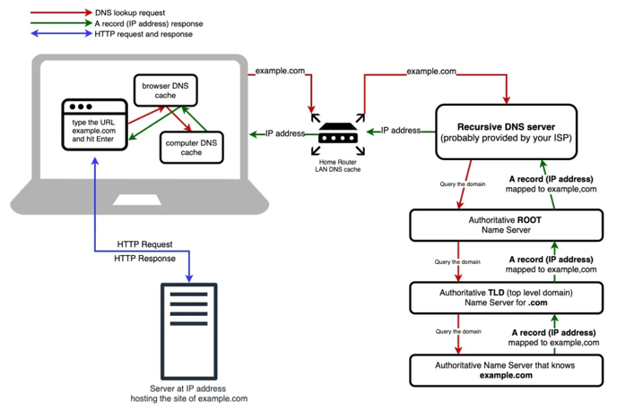

# 웹 브라우저에 네이버 URL 을 요청했을 때의 동작 과정

- source : https://xiaolishen.medium.com/the-dns-lookup-journey-240e9a5d345c

1. 웹 브라우저가 DNS 에게 도메인 이름을 IP 주소로 변환하기 위해 `DNS lookup` 과정을 수행하여 DNS로 부터 도메인 이름을 요청할 IP 주소로 응답 받는다.
   - DNS 응답은 `UDP` 를 사용하여 웹 브라우저로 전송된다.
2. 웹 브라우저는 응답받는 IP 주소를 사용하여 `3way handshake` 을 통해 `TCP Connection`을 수립한다. 
3. 웹 브라우저는 서버로 요청하기 위해 **각 계층의 헤더를 포함하며 전기 신호로 변환**하는 `encapsulation` 과정을 거쳐 서버에 요청하고,
   서버에서는 클라이언트의 요청을 전기 신호로 전달받아 `decapsulation` 거치며 **각 계층의 헤더를 통해 해석하며 요청 데이터로 변환한다.**
4. 서버는 요청을 처리한 후, 다시 클라이언트에게로 데이터를 3번 과정과 같이 전기 신호의 형태로 전달하고 클라이언트를 전기 신호로 전달받아 각 계층의 헤더 정보를
   통해 응답 데이터를 확인한다.
