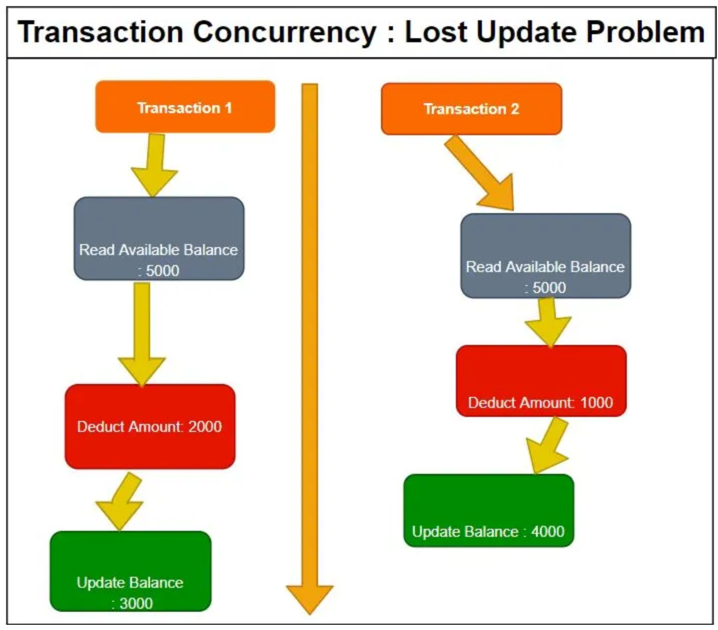
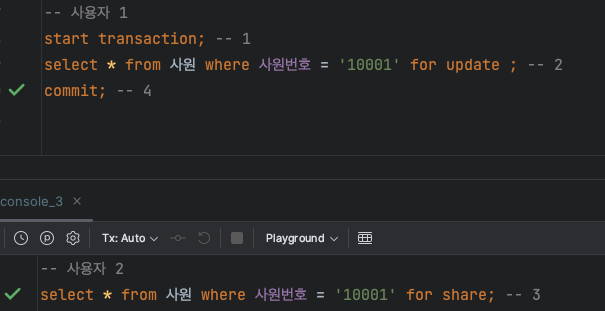
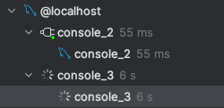
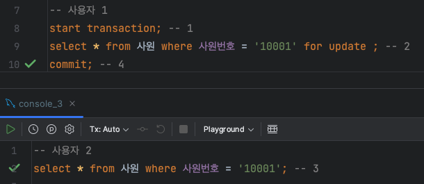
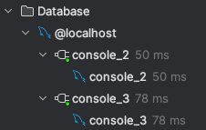

# 동시에 같은 `DB Table row` 를 업데이트 하는 상황을 방어하기 위해 어떻게 개발하나요?

## 1. `DB Table row` 를 업데이트 시, 발생할 수 있는 상황

- Source: https://sqlskull.com/2021/06/27/lost-update-problem-in-concurrent-transations/

1. `데이터 정합성 문제` : `데이터 정합성`이란 **어떤 데이터들의 값이 서로 일치하는 상태를 말한다.** 하지만 동시적을 같은 컬럼에 접근하는 경우에는 각 데이터들이
   일치하지 않는 상황이 발생할 수 있고, 이를 `데이터 부정합성` 문제라 한다.
   - `lost update problem` : 두 개의 트랜잭션이 동시에 데이터베이스 내 같은 행의 같은 열을 읽고 업데이트하려고 할 때 동시 트랜잭션에서 발생하는 데이터 
   부정합성 문제 입니다. 동시에 같은 컬럼을 읽고 update 를 처리하는 과정에서 발생할 수 있는 상황으로 이와 같은 문제를 해결하기 위해서는 다른 트랜잭션의
   **읽기에 관한 허용 범위**와 **쓰기 시점의 락 설정 여부** 이다.

 

## 2. 동시에 같은 RDB(관계형 데이터베이스) 테이블의 행을 업데이트하는 상황을 방어하기 위한 방법

### (1) 트랜잭션과 락(Lock) 을 사용

1. `락(Lock)` : 데이터의 동시 접근을 제어하기 위해 사용하는 메커니즘 입니다. 선행 트랜잭션이 락을 설정하면 다른 트랜잭션은 접근하지 못하도록 막을 수 있다.
   RDB 에서 제공하는 일반적인 락에는 `공유 락(Shared Lock)` 과 `배타적 락(Exclusive Lock)` 으로 나뉜다. 락을 설정할 떄는 
   `교착 상태(Dead Lock)` 을 주의해야 한다.
   1. `공유 락(Shared Lock)` : 트랜잭션에서 선언할 경우, 후행 트랜잭션에서 조회는 가능하지만 수정(UPDATE) 를 하고자 하는 경우,
     락을 해제하기 전까지 대기(블로킹) 한 이후, 수정(UPDATE) 를 진행한다.
   2.  `배타적 락(Exclusive Lock)` : 선행 트랜잭션에서 선언할 경우, 후행 트랜잭션의 조회, 수정 모두 불가하다. 공유 락과 마찬가지로 후행 트랜잭션이 
        수정(UPDATE) 를 시도할 경우, 락이 설정되어 대기(블로킹) 하였다가 락이 해제되면 수정(UPDATE) 을 진행한다.
   3. `교착 상태(DeadLock)`: 두 트랜잭션에 각각 `Lock` 을 설정하고 서로의 `Lock` 에 접근하고자 할 때, Lock 이 설정되어 있어 두 트랜잭션 모두
     대기하는 상태를 말한다. 이를 방지하기 위해서 `SET LOCK_TIMEOUT 설정`, `데드락 발생 예상 지점 회피`, `데드락 탐지 및 회복`,
     `트랜잭션 진행 방향을 같은 방향으로 처리`, `트랜잭션 처리 속도 최소화` 방법 등이 있다.   

 

`(1) 공유 락 & 배타 락 비교`

| 락 종류                      | 데이터 공유락 접근 가능 여부(FOR SHARE) | 데이터 배타락 접근 가능 여부(FOR EXLUSIVE) | 쿼리 예시 |
|---------------------------|:---------------------------:|:------------------------------:|:------:|
| **공유 락(Shared Lock)**     |              O              |               X                |**SELECT** * FROM table_name WHERE id = 1 **FOR SHARE**; |
| **배타적 락(Exclusive Lock)** |              X              |               X                |**SELECT** * FROM table_name WHERE id = 1 **FOR UPDATE**; |

 

`(2) 배타 락을 설정했을 때 이후 사용자의 공유 락(SELECT ... FOR SHARE) 접근 여부 확인`

1. 이후 사용자가 접근할 경우, 배타 락이 해제될 때까지 `블로킹(blocking)` 되었다가 동작

 

`(3) 배타 락을 설정했을 때 이후 사용자의 단순 조회(SELECT) 접근 여부 확인`

1. <u>대신 단순 조회의 경우에는 접근이 가능하다.</u>

### (2) 트랜잭션 격리 수준(Transaction Isolation Level) 설정

1. 트랜잭션 격리 수준을 선언하는 이유 : 여러 트랜잭션이 동일한 데이터에 접근할 경우, `dirty read`, `repeatable read`, `phantom read` 와 같은 
   동시성 문제를 야기할 수 있다. 이와 같은 문제를 트랜잭션 격리 수준을 설정함으로써 데이터 일관성과 동시성 제어를 지원한다.
2. 데이터 부정합성 문제들
   1. `Dirty Read` : 다른 트랜잭션이 도중에 결과를 조회시에 발생하는 데이터 부정합을 말합니다.
   2. `Repeatable Read` : 한 트랜잭션에서 같은 쿼리 두 번 실행시켰을 때, 다른 결과가 조회하는 현상이다.
      (하나의 트랜잭션 안에 여러 스냅샷이 사용되는 경우)
   3. `Phantom Read` : 한 트랜잭션에서 첫번째 쿼리 수행 결과와 두번째 쿼리 수행 결과가 다른 것을 의미합니다.
      (e.g. 동시에 실행 중인 트랜잭션의 insert 작업에 발생하는 조회 현상을 말합니다.)
4. 트랜잭션 격리 수준
   1. `Read Uncommited` : 커밋되지 않는 데이터도 읽을 수 있다.
      - 각 트랜잭션 내용 관계없이 다른 트랙잭션의 값을 읽을 수 있다.
   2. `Read Commited` : 커밋된 정보만 읽는다.
      - 트랜잭션이 커밋 되어 확정된 데이터만 읽는 것을 허용 한다.
   3. `Repeatable Read` : 하나의 트랜잭션에서는 하나의 스냅샷만 사용한다.
      - 선행 트랜잭션이 읽는 데이터는 종료될 때까지 후행 트랜잭션의 갱신, 삭제를 막음`으로써 일관성있는 결과를 반환한다.
      - MySQL default isolation level
   4. `Serializable` : Read 시에 DML 작업이 동시에 진행될 수 없다.
      - 선행 트랜잭션이 읽는 데이터는 종료될 때까지 후행 트랜잭션의 Command(insert, update, delete)를 막아주는 역할을 한다.

 

### (3) 충돌 감지와 락

1. `낙관적 락(Optimistic Lock)`
   - 충돌이 발생할 가능성이 있는 업데이트 작업을 수행하기 전에 해당 행의 버전 정보를 확인하는 `Application level` 에서 지원하는 락
   - 업데이트 시점에 버전이 변경되었으면 충돌이 발생한 것으로 간주하고 적절한 조치를 취한다.
2. `비관적 락(Pessimistic Lock)`: 
    - 충돌이 발생할 가능성이 있는 업데이트 작업을 수행하기 전에 해당 행에 대한 `배타적 락(Exclusive Lock)`을 설정한다.
    - 업데이트 작업이 완료되면 락을 해제하여 다른 트랜잭션이 접근할 수 있게 한다.

### (4) 분산 락(Distributed Lock)

1. 공유 자원에 대해 경쟁 상태(race condition) 을 발생하지 않도록 `Application(L7)` 에서 제공하는 락
2. 분산 환경에서 상호 배제를 구현하여 동시성 문제를 다루기 위해 락에 대한 공통 정보를 보관 및 지원하여 원자성을 보장하는 기능
3. 분산락의 저장소 예시로는 `MySQL(Named Lock)`, `Redis(Redisson or 직접 구현)` 등이 있다. 

 

## Reference

- https://nesoy.github.io/articles/2019-05/Database-Transaction-isolation
- https://velog.io/@pbg0205/%ED%8A%B8%EB%9E%9C%EC%9E%AD%EC%85%98-%EA%B2%A9%EB%A6%AC-%EC%88%98%EC%A4%80

