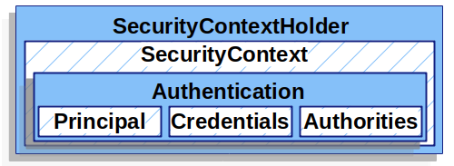
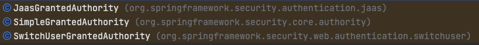
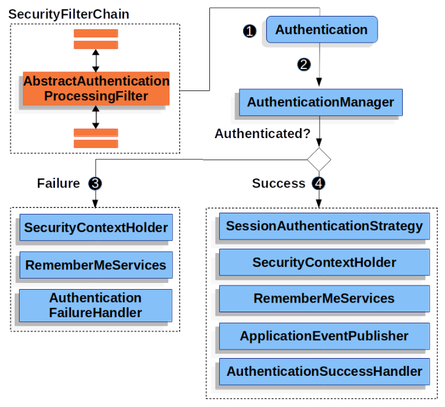

# Authentication Architecture

> [[spring.io] spring security docs 를 읽고 번역한 내용](https://docs.spring.io/spring-security/reference/5.7/servlet/authentication/architecture.html)

## Servlet Authentication Architecture

1. `SecurityContextHolder` - SecurityContextHolder는 Spring Security가 인증된 사용자에 대한 세부 정보를 저장하는 곳입니다.
2. `SecurityContext` - SecurityContextHolder에서 가져오고 현재 인증된 사용자의 인증을 포함합니다.
3. `Authentication` - 사용자가 인증을 위해 제공한 자격 증명 또는 현재 사용자를 제공하기 위해 `AuthenticationManager` 에 입력할 수 있으며,
   `SecurityContext`에서 가져올 수 있습니다.
4. `GrantedAuthority` - 인증에 대해 본인에게 부여되는 권한(예: 역할, 범위 등)
5. `AuthenticationManager` - `Spring Security` 의 필터가 인증을 수행하는 방법을 정의하는 API.
6. `ProviderManager` - `AuthenticationManager` 의 가장 일반적인 구현.
7. `AuthenticationProvider` - `ProviderManager` 가 특정 유형의 인증을 수행하는 데 사용됩니다.
8. `요청 자격 증명으로 AuthenticationEntryPoint` - 클라이언트로부터 자격 증명을 요청하는 데 사용됩니다
   (예: 로그인 페이지로 리디렉션, WWW-Authenticate 응답 전송 등).
9. `AbstractAuthenticationProcessingFilter` - 인증에 사용되는 기본 필터입니다. 
   이것은 또한 인증의 높은 수준의 흐름과 각 요소가 어떻게 함께 작동하는지에 대한 좋은 아이디어를 제공합니다.

<br>

### 1. SecurityContextHolder



`SecurityContextHolder`는 <u>Spring Security가 인증된 사용자에 대한 세부 정보를 저장하는 곳</u>입니다.
Spring Security는 SecurityContextHolder가 어떻게 채워지는지는 신경 쓰지 않습니다. <u>값이 포함되어 있으면 현재 인증된 사용자로 사용됩니다.</u>
사용자가 인증되었음을 나타내는 가장 간단한 방법은 SecurityContextHolder를 직접 설정하는 것입니다.

<br>

```java
// SecurityContext 할당
SecurityContext context = SecurityContextHolder.createEmptyContext(); 
Authentication authentication =
    new TestingAuthenticationToken("username", "password", "ROLE_USER"); 
context.setAuthentication(authentication);

SecurityContextHolder.setContext(context);

// SecurityContext 조회
SecurityContext context = SecurityContextHolder.getContext();
Authentication authentication = context.getAuthentication();
String username = authentication.getName();
Object principal = authentication.getPrincipal();
Collection<? extends GrantedAuthority> authorities = authentication.getAuthorities();
```

1. `SecurityContext` 설정 시, 여러 스레드에서 경합 조건을 피하려면 SecurityContextHolder.getContext().setAuthentication(authentication)을 사용하는 대신
   <u>새 SecurityContext 인스턴스를 생성하는 것이 중요합니다.</u>
2. 기본적으로 `SecurityContextHolder`는 <u>`ThreadLocal`을 사용하여 이러한 세부 정보를 저장한다.</u>

<br>

### 2. SecurityContext

1. `SecurityContext` 는 `SecurityContextHolder`에서 가져옵니다.
2. `SecurityContext` 에는 `Authentication` 객체가 포함됩니다.

<br>

### 3. Authentication

1. 사용자가 인증을 위해 제공한 자격 증명을 제공하기 위해 `AuthenticationManager` 에 입력합니다.
   이 시나리오에서 사용되는 경우 `isAuthenticated()`는 `false`를 반환합니다.
2. <u>현재 인증된 사용자</u>를 나타냅니다. 현재 인증은 `SecurityContext`에서 가져올 수 있습니다.
3. 하위 객체들로 `---AuthenticationToken` 이 있다.


<br>

`Authentication fields`

- `principal` - 사용자를 식별합니다. 사용자 이름/비밀번호로 인증할 때 이 값은 보통 UserDetails의 인스턴스입니다.
- `credentials` - 보통 비밀번호입니다. 대부분의 경우 이 정보는 유출되지 않도록 사용자가 인증된 후에 지워집니다.
- `authorities` - 부여된 권한은 사용자에게 부여된 높은 수준의 권한입니다. 몇 가지 예로는 역할 또는 범위가 있습니다.
  - 대표적인 `GrantedAuthority interface` 가 존재한다.
    


<br>

### 4. AuthenticationManager

1. Spring Security 의 필터가 인증을 수행하는 방법을 정의하는 API 입니다.
2. 그런 다음 반환되는 인증은 AuthenticationManager 를 호출한 컨트롤러(즉, Spring Security의 필터)에 의해 SecurityContextHolder 에 설정됩니다.
3. AuthenticationManager의 구현은 무엇이든 될 수 있지만, 가장 일반적인 구현은 `ProviderManager`입니다.

<br>

### 5. ProviderManager

1. 가장 일반적으로 사용되는 `AuthenticationManager` 의 구현체입니다. `ProviderManager`는 `AuthenticationProvider` 목록에 위임합니다.
2. 각 `AuthenticationProvider` 는 <u>인증이 성공하거나, 실패하거나, 결정을 내릴 수 없음을 표시하고</u>
   다운스트림 <u>`AuthenticationProvider` 가 결정하도록 허용할 수 있습니다.</u>
3. 실제로 각 AuthenticationProvider 는 특정 유형의 인증을 수행하는 방법을 알고 있습니다.
   (e.g. UserPassword, SAML)
4. 기본적으로 `ProviderManager`는 <u>성공적인 인증 요청에 의해 반환된 인증 객체에서 모든 민감한 자격 증명 정보를 지우려고 시도합니다.</u>
   이렇게 하면 비밀번호와 같은 정보가 HttpSession 에서 필요 이상으로 오래 유지되는 것을 방지할 수 있습니다.

<br>

### 6. AuthenticationProvider

1. 여러 `AuthenticationProvider`가 `ProviderManager`에 주입될 수 있습니다.
2. 각 `AuthenticationProvider`는 특정 유형의 인증을 수행합니다.
3. 예를 들어 `DaoAuthenticationProvider`는 사용자 이름/비밀번호 기반 인증을 지원하는 반면 `JwtAuthenticationProvider`는 JWT 토큰 인증을 지원합니다.

<br>

### 7. Request Credentials with AuthenticationEntryPoint

1. `AuthenticationEntryPoint` 는 클라이언트로부터 <u>자격 증명을 요청하는 HTTP 응답을 보내는 데 사용됩니다.</u>

<br>

### 8. AbstractAuthenticationProcessingFilter

1. `AbstractAuthenticationProcessingFilter`는 사용자 자격 증명을 인증하기 위한 기본 필터로 사용됩니다.
2. 자격 증명을 인증하기 전에 Spring Security는 일반적으로 `AuthenticationEntryPoint`를 사용하여 자격 증명을 요청합니다.

`AbstractAuthenticationProcessingFilter process`



1. 사용자가 credentials 을 제출하면 AbstractAuthenticationProcessingFilter 는 인증할 `HttpServletRequest` 에서 인증을 생성합니다.
   <u>생성되는 인증의 유형은 AbstractAuthenticationProcessingFilter의 서브클래스에 따라 다릅니다.</u> 
2. `Authentication` 이 인증할 `AuthenticationManager`로 전달됩니다.
3. 인증이 실패할 경우,
   1. SecurityContextHolder 가 지워집니다.
   2. 인증에 실패하면 `AuthenticationFailureHandler` 가 호출됩니다.
4. 인증이 성공할 경우,
   1. `SessionAuthenticationStrategy` 이 새 로그인 알림을 받습니다.
   2. `Authentication`은 SecurityContextHolder에 설정됩니다. 나중에 `SecurityContextPersistenceFilter`가 `SecureContext`를 `HttpSession`에 저장합니다.
   3. `RememberMeServices.loginSuccess`가 호출됩니다. RememberMe가 구성되지 않은 경우 이 작업은 수행되지 않습니다.
   4. `ApplicationEventPublisher`는 `InteractiveAuthenticationSuccessEvent`를 게시합니다.
   5. `AuthenticationSuccessHandler`가 호출된다.
