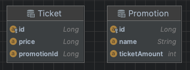
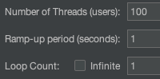

# 분산락은 Tx commit 이후에 락을 해제하자.

1. `트랜잭션 커밋 -> 락 해제` 을 권장하는 이유: 동시성 환경에서 데이터 정합성을 위함이다.
2. `락 해제 -> 트랜잭션 커밋`: 선행 트랜잭션의 내용이 반영되지 않고 후행 트랜잭션 내용만 반영되는  `second lost updates problem` 문제가 발생할 수 있다. 

## 1. 도메인 구성



`Promotion`

```java
@Entity
@Getter
@ToString
@NoArgsConstructor(access = AccessLevel.PROTECTED)
public class Promotion {

   @Id
   @GeneratedValue(strategy = GenerationType.IDENTITY)
   @Column(length = 20)
   private Long id;

   @Getter
   @Column(length = 100, nullable = false)
   private String name;

   @Column(length = 20, nullable = false)
   private int ticketAmount; // shared resources (warning race condition!)

    public Promotion(final String name, final int ticketAmount) {
      this.name = name;
      this.ticketAmount = ticketAmount;
   }

   public void decreaseTicketAmount() {
      this.ticketAmount -= 1;
   }

   public boolean soldOut() {
      return ticketAmount <= 0;
   }

   public int remainingTickets() {
      return this.ticketAmount;
   }

}
```

`Ticket`

```java
@Entity
@NoArgsConstructor(access = AccessLevel.PROTECTED)
public class Ticket {

    @Id
    @GeneratedValue(strategy = GenerationType.IDENTITY)
    private Long id;

    @Column(length = 15, nullable = false)
    private Long price;

    @Column(length = 20, nullable = false)
    private Long promotionId;

    public Ticket(final Long price, final Long promotionId) {
        this.price = price;
        this.promotionId = promotionId;
    }

}
```

1. 연관관계를 사용하는 경우
   - 장점
     1. 매번 티켓 수를 조회하기 위한 조회 쿼리를 동작하므로 `race condition` 에 관해 할 필요가 없다. 

        다만, 여러 트랜잭션이 insert 하는 시점에 따라 티켓 사이즈가 정확히 일치하는 않는 이슈가 발생할 수 있다.
     
     2. Promotion 안에 Ticket 을 관리하는 형태로 `로직을 응집화` 할 수 있는 장점이 있다.
   - 단점
     1. 생성된 티켓 수를 확인하기 위한 조회 쿼리가 필요하다.
        - Ticket 테이블의 데이터양이 증가함에 따라 인덱스의 데이터 추가와 DB 부하를 줄 수 있다.
2. 연관 관계를 사용하지 않는 경우(티켓 잔여량을 관리하는 컬럼 활용하는 경우)
   - 장점
     1. 티켓 사이즈를 확인하는 부수적 쿼리를 발생하지 않아 `index row insert`, `query 수행` 에 관한 DB 부하를 줄일 수 있는 장점이 있다.
   - 단점
     1. 잔여 티켓 데이터의 `race condition` 을 고려해야 한다. 동시 접근할 경우, 데이터 정합성이 깨질 수 있다.

## 2. JMeter 를 이용한 테스트

|  index  |                   api                   | explanation  |
|:-------:|:---------------------------------------:|:--------:|
|    1    | /api/v1/promotions/{promotionId}/ticket | @Transactional |
|    2    |   /api/v2/promotions/{promotionId}/ticket   | rLock.unlock()-> @Transactional commit |
|    3    |   /api/v3/promotions/{promotionId}/ticket   | @Transactional commit -> rLock.unlock() |

### (1) ticketAmount, user 100개 동일하게 세팅

1. thread condition

    

2. 100개 HTTP Requests

    |                    type                     | 잔여 티켓 수  | 실제 생성 티켓 | 데이터 정합성 유지 |
    |:-------------------------------------------:|:--------:|:--------:|:----------:|
    |              `@Transactional`               | 45 / 100 |   100    |     X      |
    | ` rLock.unlock()`→ `@Transactional commit`  | 38 / 100 |   100    |     X      |
    | `@Transactional commit` → `rLock.unlock()` | 0 / 100 | 100 | O


### References

- [[Redisson] What is a Java distributed lock?](https://redisson.org/glossary/java-distributed-lock.html)
- [[kurly tech blog] 풀필먼트 입고 서비스팀에서 분산락을 사용하는 방법 - Spring Redisson](https://helloworld.kurly.com/blog/distributed-redisson-lock/)
