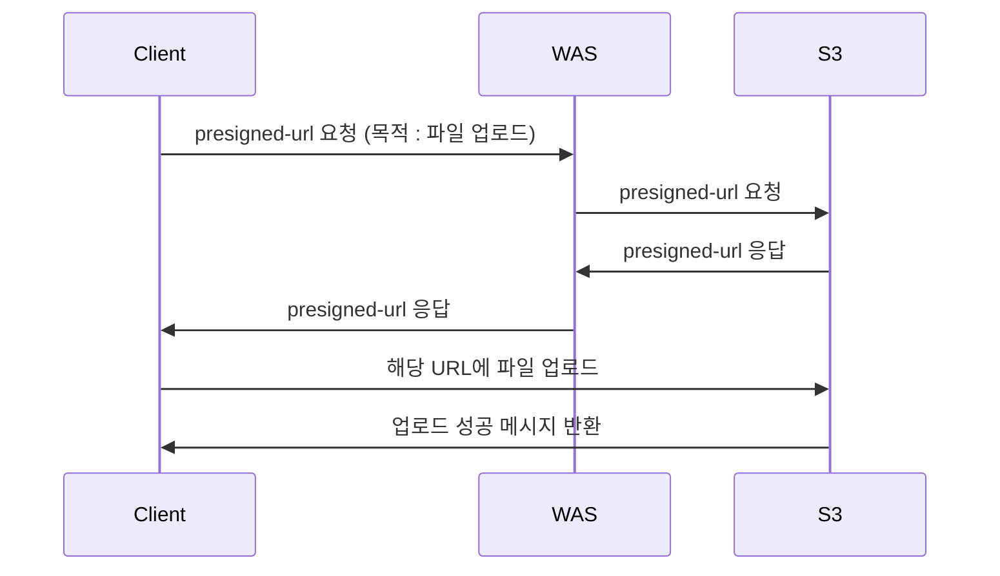
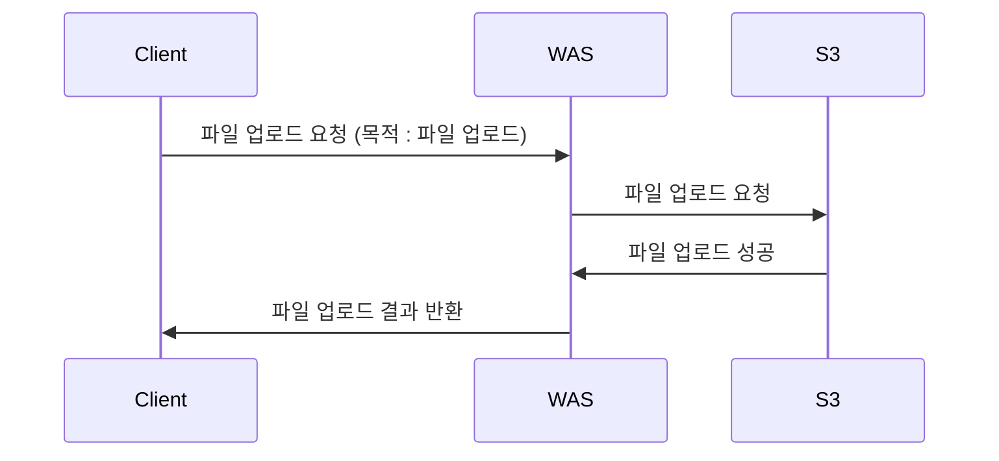

# Presigned URL (with S3)

## 1. spring cloud s3

- [Set up a Gradle project that uses the AWS SDK for Java 2.x](https://docs.aws.amazon.com/sdk-for-java/latest/developer-guide/setup-project-gradle.html)
- [spring-cloud-aws docs](https://docs.awspring.io/spring-cloud-aws/docs/3.0.0/reference/html/index.html#getting-started)
- [spring-cloud-aws docs_s3 template](https://docs.awspring.io/spring-cloud-aws/docs/3.0.0/reference/html/index.html#using-s3template)

<br>

## 2. presigned-url vs multipart

### (1) presigned-url 요청 흐름



### (2) multipart 요청 흐름



<br>

## 3. application.yml 설정

```yaml
spring:
  application:
    name: presigned_url
  cloud:
    aws:
      s3:
        region: # TODO region 설정하기
      credentials:
        access-key: # TODO access-key 설정하기
        secret-key: # TODO secret-key 설정하기
logging:
  level:
    io:
      awspring:
        cloud: debug

aws:
  bucket:
    name: # TODO bucket name 설정하기 (custom property)

```
- ref : [spring-cloud-aws_configuring](https://docs.awspring.io/spring-cloud-aws/docs/3.0.0/reference/html/index.html#configuring)
