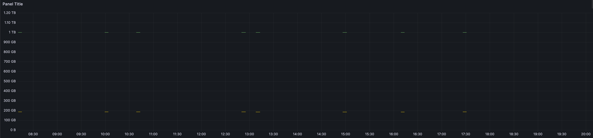

# 프로덕션 준비 기능

- 프로덕션 준비 기능 : 운영 환경에서 서비스할 때 필요한 비기능적 요소들
- 예시 : 지표(metric), 추적(trace), 감사(auditing)
- actuator : 시스템을 움직이거나 제어하는 데 쓰이는 기계 장치

<br>

# 1. actuator 시작

## [1] 동작 확인

```bash
http://localhost:8080/actuator/health
```
```json
{
  "_links": {
    "self": {
      "href": "http://localhost:8080/actuator",
      "templated": false
    },
    "health": {
      "href": "http://localhost:8080/actuator/health",
      "templated": false
    },
    "health-path": {
      "href": "http://localhost:8080/actuator/health/{*path}",
      "templated": true
    }
  }
}
```

<br>

## [2] application health status 확인

- 현재 서버가 잘 동작하고 있는지 애플리케이션의 헬스 상태를 확인

```bash
http://localhost:8080/actuator/health
```

```json
{
  "status":"UP"
}
```

<br>

## [3] actuator 기능 웹에 노출

### (1) 엔드포인트 기능 웹 노출 설정 (application.yml)

- 엔드포인트 : 액츄에이터가 제공하는 기능
- 예시
   - health - 헬스 정보
   - beans - 스프링 컨테이너 등록 빈

```yaml
management:
    endpoints:
      web:
        exposure:
          include: "*"

```

<br>

### (2) 요청 확인

```http request
http://localhost:8080/actuator
```
```json
      "info":{
         "href":"http://localhost:8080/actuator/info",
         "templated":false
      },
      "conditions":{
         "href":"http://localhost:8080/actuator/conditions",
         "templated":false
      },
      "configprops":{
         "href":"http://localhost:8080/actuator/configprops",
         "templated":false
      },
      "configprops-prefix":{
         "href":"http://localhost:8080/actuator/configprops/{prefix}",
         "templated":true
      },
      "env-toMatch":{
         "href":"http://localhost:8080/actuator/env/{toMatch}",
         "templated":true
      },
      "env":{
         "href":"http://localhost:8080/actuator/env",
         "templated":false
      },
      "loggers-name":{
         "href":"http://localhost:8080/actuator/loggers/{name}",
         "templated":true
      },
      "loggers":{
         "href":"http://localhost:8080/actuator/loggers",
         "templated":false
      },
      "heapdump":{
         "href":"http://localhost:8080/actuator/heapdump",
         "templated":false
      },
      "threaddump":{
         "href":"http://localhost:8080/actuator/threaddump",
         "templated":false
      },
      "metrics-requiredMetricName":{
         "href":"http://localhost:8080/actuator/metrics/{requiredMetricName}",
         "templated":true
      },
      "metrics":{
         "href":"http://localhost:8080/actuator/metrics",
         "templated":false
      },
      "scheduledtasks":{
         "href":"http://localhost:8080/actuator/scheduledtasks",
         "templated":false
      },
      "mappings":{
         "href":"http://localhost:8080/actuator/mappings",
         "templated":false
      }
   }
}
```

### (3) 헬스 정보 확인 

1. 애플리케이션 헬스 정보

```http request
http:://localhost:8080/actuator/health
```

```json
{
  "status":"UP"
}

```

2. 스프링 컨테이너에 등록된 빈

```http request
http:://localhost:8080/actuator/beans
```

```json
 {
  "contexts":{
    "application":{
      "beans":{
        "spring.jpa-org.springframework.boot.autoconfigure.orm.jpa.JpaProperties":{
          "aliases":[

          ],
          "scope":"singleton",
          "type":"org.springframework.boot.autoconfigure.orm.jpa.JpaProperties",
          "resource":null,
          "dependencies":[

          ]
        },
        "endpointCachingOperationInvokerAdvisor":{
          "aliases":[

          ],
          "scope":"singleton",
          "type":"org.springframework.boot.actuate.endpoint.invoker.cache.CachingOperationInvokerAdvisor",
          "resource":"class path resource [org/springframework/boot/actuate/autoconfigure/endpoint/EndpointAutoConfiguration.class]",
          "dependencies":[
            "org.springframework.boot.actuate.autoconfigure.endpoint.EndpointAutoConfiguration",
            "environment"
          ]
        },
        "defaultServletHandlerMapping":{
          "aliases":[

          ],
          "scope":"singleton",
          "type":"org.springframework.web.servlet.HandlerMapping",
          "resource":"class path resource [org/springframework/boot/autoconfigure/web/servlet/WebMvcAutoConfiguration$EnableWebMvcConfiguration.class]",
          "dependencies":[
            "org.springframework.boot.autoconfigure.web.servlet.WebMvcAutoConfiguration$EnableWebMvcConfiguration"
          ]
        },
        "metricsRestTemplateCustomizer":{
          "aliases":[

          ],
          "scope":"singleton",
          "type":"org.springframework.boot.actuate.metrics.web.client.MetricsRestTemplateCustomizer",
          "resource":"class path resource [org/springframework/boot/actuate/autoconfigure/metrics/web/client/RestTemplateMetricsConfiguration.class]",
          "dependencies":[
            "org.springframework.boot.actuate.autoconfigure.metrics.web.client.RestTemplateMetricsConfiguration",
            "simpleMeterRegistry",
            "restTemplateExchangeTagsProvider",
            "management.metrics-org.springframework.boot.actuate.autoconfigure.metrics.MetricsProperties"
          ]
        },
        "applicationTaskExecutor":{
          "aliases":[
            "taskExecutor"
          ],
          "scope":"singleton",
          "type":"org.springframework.scheduling.concurrent.ThreadPoolTaskExecutor",
          "resource":"class path resource [org/springframework/boot/autoconfigure/task/TaskExecutionAutoConfiguration.class]",
          "dependencies":[
            "org.springframework.boot.autoconfigure.task.TaskExecutionAutoConfiguration",
            "taskExecutorBuilder"
          ]
        },
        "persistenceExceptionTranslationPostProcessor":{
          "aliases":[

          ],
          "scope":"singleton",
          "type":"org.springframework.dao.annotation.PersistenceExceptionTranslationPostProcessor",
          "resource":"class path resource [org/springframework/boot/autoconfigure/dao/PersistenceExceptionTranslationAutoConfiguration.class]",
          "dependencies":[
            "environment"
          ]
        }
    // ...
}
```

## [4] 엔드포인트 설정

- 엔드 포인트 사용을 위해서는 `엔드포인트 활성화`, `엔드포인트 노출` 과정이 필요
  1. 엔드포인트 활성화 : 해당 기능 사용 여부(on, off) 를 선택 (default: 활성화!)
  2. 엔드포인트 노출 : 활성화 이후 HTTP, JMX 등의 위치에 노출 여부를 지정하는 것 
 

### (1) 엔드포인트 활성화: 모든 엔드포인트를 웹에 노출

- `management.endpoints.web.exposure.include: "*"` : 모든 엔드포인트를 웹에 노출하는 것
- `shutdown` : 실제 서버를 종료하는 엔드포인트(기본으로 비활성화되므로 노출되지 않음)

```yaml
management:
    endpoints:
      web:
        exposure:
          include: "*"
```

### (2) 엔드포인트 활성화: application.yml - shutdown 엔드포인트 활성화

- shutdown : 실제 서버를 종료하는 엔드포인트
- 특정 엔드포인트 활성법
   - `management.endpoint.{엔드포인트명}.enabled=true`
   - `POST` 요청 설정

```http request
POST /actuator/shutdown HTTP/1.1
Host: localhost:8080
Content-Type: application/json
Content-Length: 27
```

```yaml
management:
    endpoint:
      shutdown:
        enabled: true # shutdown 엔드포인트 활성화
    endpoints:
      web:
        exposure:
          include: "*"
```

3. 결과
```json
{
  "message": "Shutting down, bye..."
}
```

<br>

### (3) 엔드포인트 활성화: application.yml - exposure include, exclude 설정

1. jmx 에 health, info 노출
    ```yaml
    management:
        endpoints:
          jmx:
            exposure:
              include: "health,info"
    ```

2. web 에 모든 엔드포인트 노출하지만 env, beans 제외
    ```yaml
    management:
        endpoints:
          web:
            exposure:
              include: "*"
              exclude: "env,beans"
    ```

### (4) 엔드 포인트 목록들

1. `beans` : 스프링 컨테이너에 등록된 스프링 빈을 보여준다.
2. `conditions` : condition 을 통해서 빈을 등록할 때 평가 조건과 일치하거나 일치하지 않는 이유를 표시한다.
3. `configprops` : @ConfigurationProperties 를 보여준다.
4. `env` : Environment 정보를 보여준다.
5. `health` : 애플리케이션 헬스 정보를 보여준다.
6. `httpexchanges` : HTTP 호출 응답 정보를 보여준다. **HttpExchangeRepository** 를 구현한 빈을 별도로 등록해야 한다.
7. `info` : 애플리케이션 정보를 보여준다.
8. `loggers` : 애플리케이션 로거 설정을 보여주고 변경도 할 수 있다.
9. `metrics` : 애플리케이션의 메트릭 정보를 보여준다.
10. `mappings` : @RequestMapping 정보를 보여준다.
11. `threaddump` : 쓰레드 덤프를 실행해서 보여준다.
12. `shutdown` : 애플리케이션을 종료한다. 이 기능은 기본으로 비활성화 되어 있다.

<br>

## [5] 헬스 정보

### (1) management.endpooint.health.show-details=always

- 헬스 정보를 자세하게 보기 위한 옵션 설정

```yaml
management:
    endpoint:
      health:
        show-details: always
```
```
GET /actuator/health HTTP/1.1
Host: localhost:8080
```
```json
{
    "status": "UP",
    "components": {
        "db": {
            "status": "UP",
            "details": {
                "database": "H2",
                "validationQuery": "isValid()"
            }
        },
        "diskSpace": {
            "status": "UP",
            "details": {
                "total": 1000240963584,
                "free": 816058421248,
                "threshold": 10485760,
                "exists": true
            }
        },
        "ping": {
            "status": "UP"
        }
    }
}
```

### (2) management.endpooint.health.show-components=always

```yaml
  management:
    endpoint:
      health:
        show-components: always
```

```json
{
    "status": "UP", // 하나라도 문제가 있으면 DOWN
    "components": {
        "db": {
            "status": "UP" 
        },
        "diskSpace": {
            "status": "UP"
        },
        "ping": {
            "status": "UP"
        }
    }
}
```

## [6] 애플리케이션 정보

### (1) info endpoint 

1. `info` : 애플리케이션 기본 정보를 노출

### (2) 기능 제공들

- 기능 제공 기능들 (env, java, os 는 기본 비활성화)
    1. `java` : 자바 런타임 정보
    2. `os` : OS 정보
    3. `env` : Environment 에서 info. 로 시작하는 정보
    4. `build` : 빌드 정보. (`META-INF/build-info.properties`) 파일이 필요
    5. `git` : git 정보, `git.properties` 파일이 필요

### (3) 설정 확인 : java, os

- `management.info.<id>.enabled: true` 로 설정
1. java, os 정보 확인
    ```yaml
      management:
        info:
          java:
            enabled: true
          os:
            enabled: true
    ```

2. 요청
    ```http request
    GET /actuator/info HTTP/1.1
    Host: localhost:8080
    ```

2. 응답
    ```json
    {
      "java": {
        "version": "11.0.19",
        "vendor": {
          "name": "Amazon.com Inc.",
          "version": "Corretto-11.0.19.7.1"
        },
        "runtime": {
          "name": "OpenJDK Runtime Environment",
          "version": "11.0.19+7-LTS"
        },
        "jvm": {
          "name": "OpenJDK 64-Bit Server VM",
          "vendor": "Amazon.com Inc.",
          "version": "11.0.19+7-LTS"
        }
      },
      "os": {
        "name": "Mac OS X",
        "version": "13.4.1",
        "arch": "x86_64"
      }
    }
    ```

<br>

### (4) 설정 확인 : env

1. env 정보 확인 설정 및 info 정보 설정
    ```yaml
    management:
      info:
        env:
          enabled: true
    
    info:
      app:
        name: hello-actuator
        company: cooper
    ```

2. 요청
    ```http request
    GET /actuator/info HTTP/1.1
    Host: localhost:8080
    ```

3. 응답
    ```json
    {
        "app": {
            "name": "hello-actuator",
            "company": "cooper"
        }
    }
    ```
    
<br>

### (5) 설정 확인 : build
    
1. build.gradle - 빌드 정보 추가
    ```groovy
    springBoot {
        buildInfo()
    }
    ```

2. 빌드 시 `resource/META-INF/build-info.properties` 생성

   
    
   ```text
    build.artifact=spring-actuator
    build.group=com.cooper
    build.name=spring-actuator
    build.time=2023-11-01T06\:40\:15.037525Z
    build.version=0.0.1-SNAPSHOT
    ```

3. 요청
    ```http request
    GET /actuator/info HTTP/1.1
    Host: localhost:8080
    ```
   
4. 응답
    ```json
    {
      "build": {
        "artifact": "spring-actuator",
        "name": "spring-actuator",
        "time": "2023-11-01T06:43:41.431Z",
        "version": "0.0.1-SNAPSHOT",
        "group": "com.cooper"
      }
    }
    ```
### (6) 설정 확인 : logger

1. log level 설정
    ```yaml
    logging:
      level:
        com.cooper.com.cooper.springactuator.controller: debug
    ```

2. 요청 : 전체 로거 레벨 파악
    ```http request
    GET /actuator/loggers HTTP/1.1
    Host: localhost:8080
    ```

3. 응답 : 전체 로거 레벨 파악
    ```json
    {
      "levels": [
        "OFF",
        "ERROR",
        "WARN",
        "INFO",
        "DEBUG",
        "TRACE"
      ],
      "loggers": {
        "ROOT": {
          "configuredLevel": "INFO",
          "effectiveLevel": "INFO"
        },
        "com.cooper.springactuator.controller": {
          "configuredLevel": "DEBUG",
          "effectiveLevel": "DEBUG"
        }
      }
    }
    ```
4. 요청 : 특정 로거 이름 기준 조회
    ```http request
    GET /actuator/loggers/com.cooper.springactuator.controller HTTP/1.1
    Host: localhost:8080
    ```
5. 응답 : 특정 로거 이름 기준 조회
    ```json
    {
        "configuredLevel": "DEBUG",
        "effectiveLevel": "DEBUG"
    }
    ```
6. 요청 : 실시간 로그 레벨 변경
    ```http request
    POST /actuator/loggers/com.cooper.springactuator.controller HTTP/1.1
    Host: localhost:8080
    Content-Type: application/json
    Content-Length: 38
    
    {
          "configuredLevel": "TRACE"
      }
    ```
7. 응답 : 실시간 로그 레벨 변경
    ```text
    HTTP/1.1 204 No Content
    ```
8. 요청 로그 확인 
    ```text
    GET /log HTTP/1.1
    Host: localhost:8080
    ```
    ```text
    2023-11-01 16:03:15.280 TRACE 13323 --- [nio-8080-exec-2] c.c.s.controller.LogController           : trace log
    2023-11-01 16:03:15.282 DEBUG 13323 --- [nio-8080-exec-2] c.c.s.controller.LogController           : debug log
    2023-11-01 16:03:15.282  INFO 13323 --- [nio-8080-exec-2] c.c.s.controller.LogController           : info log
    2023-11-01 16:03:15.282  WARN 13323 --- [nio-8080-exec-2] c.c.s.controller.LogController           : warn log
    2023-11-01 16:03:15.282 ERROR 13323 --- [nio-8080-exec-2] c.c.s.controller.LogController           : error log
    ```
9. 요청 : 변경된 로그 레벨 확인
    ```http request
    GET /actuator/loggers/com.cooper.springactuator.controller HTTP/1.1
    Host: localhost:8080
    ```
10. 응답 : 변경된 로그 레벨 확인
    ```json
    // 응답 값
    {
        "configuredLevel": "TRACE",
        "effectiveLevel": "TRACE"
    }
    ```

## [7] HTTP 요청 응답 기록

- `httpexchanges` : HTTP 요청과 응답의 과거 기록 확인 엔트포인트
  - `boot ver >= 3.0` : `HttpExchangeRepository` 인터페이스의 구현체를 빈으로 등록하면 httpexchanges 엔드포인트 사용 가능
  - `boot ver == 2.xx` : `InMemoryHttpTraceRepository` 인터페이스의 구현체를 빈으로 등록하면 httpexchanges 엔드포인트 사용 가능

### (1) 요청 내역 확인

1. 요청 : 요청 내역 확인
   - `boot ver >= 3.0` :  `/actuator/httpexchange`
   - `boot ver == 2.xx` : `/actuator/httptrace`

    ```http request
    GET /actuator/httptrace HTTP/1.1
    Host: localhost:8080
    ```
2. 응답 : 요청 내역 확인
    ```json
    {
        "traces": [
            {
                "timestamp": "2023-11-01T07:10:26.858356Z",
                "principal": null,
                "session": null,
                "request": {
                    "method": "GET",
                    "uri": "http://localhost:8080/actuator",
                    "headers": {
                        "postman-token": [
                            "76ceeb8c-2879-4b12-b027-8214f46c9e94"
                        ],
                        "host": [
                            "localhost:8080"
                        ],
                        "connection": [
                            "keep-alive"
                        ],
                        "cache-control": [
                            "no-cache"
                        ],
                        "accept-encoding": [
                            "gzip, deflate, br"
                        ],
                        "user-agent": [
                            "PostmanRuntime/7.32.2"
                        ],
                        "accept": [
                            "*/*"
                        ]
                    },
                    "remoteAddress": null
                },
                "response": {
                    "status": 200,
                    "headers": {
                        "Transfer-Encoding": [
                            "chunked"
                        ],
                        "Keep-Alive": [
                            "timeout=60"
                        ],
                        "Connection": [
                            "keep-alive"
                        ],
                        "Date": [
                            "Wed, 01 Nov 2023 07:10:26 GMT"
                        ],
                        "Content-Type": [
                            "application/vnd.spring-boot.actuator.v3+json"
                        ]
                    }
                },
                "timeTaken": 11
            },
            {
                "timestamp": "2023-11-01T07:10:14.246796Z",
                "principal": null,
                "session": null,
                "request": {
                    "method": "GET",
                    "uri": "http://localhost:8080/actuator/htttptrace",
                    "headers": {
                        "postman-token": [
                            "dabf8562-81bf-465e-b683-d6f85c473bb5"
                        ],
                        "host": [
                            "localhost:8080"
                        ],
                        "connection": [
                            "keep-alive"
                        ],
                        "cache-control": [
                            "no-cache"
                        ],
                        "accept-encoding": [
                            "gzip, deflate, br"
                        ],
                        "user-agent": [
                            "PostmanRuntime/7.32.2"
                        ],
                        "accept": [
                            "*/*"
                        ]
                    },
                    "remoteAddress": null
                },
                "response": {
                    "status": 404,
                    "headers": {
                        "Vary": [
                            "Origin",
                            "Access-Control-Request-Method",
                            "Access-Control-Request-Headers"
                        ]
                    }
                },
                "timeTaken": 2
            }
        ]
    }
    ```

## [8] 액츄에이터와 보안

### (1) 보안 주의

- actuator 는 application 내부 정보가 많이 노출된다.
- actuator 는 외부에 접근 불가능하게 막고, 내부에서만 접근 가능한 내부망을 사용하는 것을 권장
- 보안을 유지할 수 있는 방법
  1. actuator port 변경
  2. actuator URL 경로 인증 설정
  3. endpoint 경로 변경

### (2) actuator 포트 변경

```yaml
management:
  server:
    port: 9282
```

```http request
http://localhost:9292/actuator
```

### (3) actuator URL 경로 인증 설정

- 포트 분리가 어렵고 외부 인터넷 망을 사용해 접근해야 한다면 /actuator 경로에 인증 사용자만 접근 가능하도록 추가 개발 필요

### (4) 엔드포인트 경로 변경

```yaml
management:
endpoints:
  web:
    base-path: "/manage"
```
1. `/actuator/{endpoint}` 대신 `/manage/{엔드포인트}` 로 변경

<br>

# 2. 마이크로미터

## [1] Micrometer??

1. application metric 측정 방식을 추상화한 것을 말한다. 
2. `Application metric(측정 지표)` 을 micrometer 가 정한 표준 방법으로 모아서 제공한다. (`Application Facade` 라고도 불림)
3. spring-boot actuator 는 `micrometer` 를 내장하고 있다.
4. micrometer 지원 모니터링 툴 : AppOptics, Atlas, CloudWatch, Datadog, Prometheus


## [2] 메트릭 확인하기

1. spring-boot actuator 가 micrometer 가 제공하는 지표 수집을 `@AutoConfiguration` 을 통해 자동 등록
2. 개발자가 각각의 지표를 직접 수집해서 micrometer 표준 방법에 따라 등록한다.

### (1) 메트릭 확인 : 기본 제공 메트릭 확인

```http request
GET /actuator/metrics/jvm.memory.used HTTP/1.1
Host: localhost:8080
```

### (2) 메트릭 응답 바디

```json
{
    "names": [
        "application.ready.time",
        "application.started.time",
        "disk.free",
        "disk.total",
        "executor.active",
        "executor.completed",
        "executor.pool.core",
        "executor.pool.max",
        "executor.pool.size",
        "executor.queue.remaining",
        "executor.queued",
        "hikaricp.connections",
        "hikaricp.connections.acquire",
        "hikaricp.connections.active",
        "hikaricp.connections.creation",
        "hikaricp.connections.idle",
        "hikaricp.connections.max",
        "hikaricp.connections.min",
        "hikaricp.connections.pending",
        "hikaricp.connections.timeout",
        "hikaricp.connections.usage",
        "http.server.requests",
        "jdbc.connections.max",
        "jdbc.connections.min",
        "jvm.buffer.count",
        "jvm.buffer.memory.used",
        "jvm.buffer.total.capacity",
        "jvm.classes.loaded",
        "jvm.classes.unloaded",
        "jvm.gc.live.data.size",
        "jvm.gc.max.data.size",
        "jvm.gc.memory.allocated",
        "jvm.gc.memory.promoted",
        "jvm.gc.overhead",
        "jvm.gc.pause",
        "jvm.memory.committed",
        "jvm.memory.max",
        "jvm.memory.usage.after.gc",
        "jvm.memory.used",
        "jvm.threads.daemon",
        "jvm.threads.live",
        "jvm.threads.peak",
        "jvm.threads.states",
        "logback.events",
        "process.cpu.usage",
        "process.files.max",
        "process.files.open",
        "process.start.time",
        "process.uptime",
        "system.cpu.count",
        "system.cpu.usage",
        "system.load.average.1m",
        "tomcat.sessions.active.current",
        "tomcat.sessions.active.max",
        "tomcat.sessions.alive.max",
        "tomcat.sessions.created",
        "tomcat.sessions.expired",
        "tomcat.sessions.rejected"
    ]
}
```

### (3) 메트릭 확인 : JVM 메모리 사용량

```http request
GET /actuator/metrics/jvm.memory.used HTTP/1.1
Host: localhost:8080
```

### (4) 메트릭 응답 바디 : JVM 메모리 사용량

```json
{
  "name": "jvm.memory.used",
  "description": "The amount of used memory",
  "baseUnit": "bytes",
  "measurements": [
    {
      "statistic": "VALUE",
      "value": 1.36190064E8
    }
  ],
  "availableTags": [
    {
      "tag": "area",
      "values": [
        "heap",
        "nonheap"
      ]
    },
    {
      "tag": "id",
      "values": [
        "G1 Old Gen",
        "CodeHeap 'non-profiled nmethods'",
        "G1 Survivor Space",
        "Compressed Class Space",
        "Metaspace",
        "G1 Eden Space",
        "CodeHeap 'non-nmethods'"
      ]
    }
  ]
}
```

### (5) 메트릭 확인 : JVM 메모리 사용량 : 태그 사용 (heap 영역)

```http request
GET /actuator/metrics/jvm.memory.used?tag=area:heap HTTP/1.1
Host: localhost:8080
```

### (6) 메트릭 응답 바디 : JVM 메모리 사용량 : 태그 사용

```json
{
  "name": "jvm.memory.used",
  "description": "The amount of used memory",
  "baseUnit": "bytes",
  "measurements": [
    {
      "statistic": "VALUE",
      "value": 6.1464864E7
    }
  ],
  "availableTags": [
    {
      "tag": "id",
      "values": [
        "G1 Survivor Space",
        "G1 Old Gen",
        "G1 Eden Space"
      ]
    }
  ]
}
```

### (7) 메트릭 확인 : JVM 메모리 사용량 : 태그 사용 (heap 영역)

```http request
GET /actuator/metrics/jvm.memory.used?tag=area:heap HTTP/1.1
Host: localhost:8080
```

### (8) 메트릭 응답 바디 : JVM 메모리 사용량 : 태그 사용

```json
{
  "name": "jvm.memory.used",
  "description": "The amount of used memory",
  "baseUnit": "bytes",
  "measurements": [
    {
      "statistic": "VALUE",
      "value": 6.3562016E7
    }
  ],
  "availableTags": [
    {
      "tag": "id",
      "values": [
        "G1 Survivor Space",
        "G1 Old Gen",
        "G1 Eden Space"
      ]
    }
  ]
}
```

### (9) HTTP 요청 관련 메트릭
```text
#1 HTTP 요청 수를 확인
http://localhost:8080/actuator/metrics/http.server.requests

#2 /log 요청만 필터 (사전 /log 요청 필요)
http://localhost:8080/actuator/metrics/http.server.requests?tag=uri:/log

#3 /log 요청 & HTTP Status = 200
http://localhost:8080/actuator/metrics/http.server.requests?tag=uri:/log&tag=status:200
```

<br>

## [3] 메트릭 종류

1. JVM 메트릭
2. 시스템 메트릭
3. 애플리케이션 시작 메트릭
4. 스프링 MVC 메트릭
5. 톰캣 메트릭
6. 데이터 소스 메트릭
7. 로그 메트릭
8. 기타 수 많은 메트릭
9. 사용자가 메트릭

### (1) JVM 메트릭

1. jvm. 으로 시작
2. 관련 정보
   - 메모리 및 버퍼 풀 세부 정보
   - 가비지 수집 관련 통계
   - 스레드 활용
   - 로드 및 언로드된 클래스 수
   - JVM 버전 정보
   - JIT 컴파일 시간

### (2) 시스템 메트릭

1. `system.`, `process.`, `disk.` 으로 시작한다.
2. 관련 지표
   1. CPU 지표
   2. 파일 디스크립터 메트릭
   3. 가동 시간 메트릭
   4. 사용 가능한 디스크 공간

### (3) 애플리케이션 시작 시간 메트릭

1. `application.started.time` : 애플리케이션을 시작하는데 걸리는 시간 ( ApplicationStartedEvent 로 측정)
2. `application.ready.time` : 애플리케이션이 요청을 처리할 준비가 되는데 걸리는 시간 ( ApplicationReadyEvent 로 측정)

### (4) 스프링 MVC 메트릭

1. 메트릭 이름: `http.server.requests`
2. 관련 TAG 정보
   - `uri` : 요청 URI
   - `method` : GET , POST 같은 HTTP 메서드
   - `status` : 200 , 400 , 500 같은 HTTP Status 코드
   - `exception` : 예외
   - `outcome` : 상태코드를 그룹으로 모아서 확인
     - **1xx:INFORMATIONAL**
     - **2xx:SUCCESS**
     - **3xx:REDIRECTION**
     - **4xx:CLIENT_ERROR**
     - **5xx:SERVER_ERROR**

### (5) 데이터소스 메트릭

1. DataSource , 커넥션 풀에 관한 메트릭을 확인
2. `jdbc.connections.` 으로 시작 (카리 커넥션 풀을 사용하면 `hikaricp.` 확인 가능)
3. 관련 정보
   - 최대 커넥션
   - 최소 커넥션
   - 활성 커넥션
   - 대기 커넥션 수

### (6) 로그 메트릭

1. `logback.events` : logback 로그에 대한 메트릭을 확인
2. trace, debug, info, warn, error 각각의 로그 레벨에 따른 로그 수를 확인

### (7) 톰캣 메트릭

1. `tomcat.` 으로 시작한다.
2. 톰캣 메트릭을 모두 사용하려면 다음 옵션을 켜야한다. (옵션을 켜지 않으면 tomcat.session. 관련 정보만 노출된다.)
   - 톰캣의 최대 쓰레드, 사용 쓰레드 수를 포함한 다양한 메트릭을 확인
    ```yaml
     server:
        tomcat:
          mbeanregistry:
            enabled: true
    ```

### (8) 그 외 메트릭
1. HTTP 클라이언트 메트릭( RestTemplate , WebClient ) 캐시 메트릭
2. 작업 실행과 스케줄 메트릭
3. 스프링 데이터 리포지토리 메트릭
4. 몽고DB 메트릭
5. 레디스 메트릭

# 3. 프로메테우스 (Prometheus)

## [1] 프로메테우스 설치

### (1) 설치 방법

1. [github prometheus masos 2.47.2(2023.11.04 기준)](https://github.com/prometheus/prometheus/releases/tag/v2.47.2)
2. 해당 디렉토리에 들어가서 prometheus 설치 : `./prometheus`
3. 마이크로미터 프로메테우스 구현 라이브러리 추가
    ```groovy
    implementation 'io.micrometer:micrometer-registry-prometheus' //추가
    ```
4. `localhost:8080/actuator/prometheus` 을 라이브러리 동작 확인

### (2) prometheus.yml 설정

- prometheus.yml 설정을 통해

```yaml
global:
    scrape_interval: 15s # global 수집 주기
    evaluation_interval: 15s # alert을 보낼지 말지 메트릭을 보고 판단하는 주기
alerting:
  alertmanagers:
    - static_configs:
        - targets:
          # - alertmanager:9093
rule_files:
scrape_configs:
  - job_name: "prometheus"
    static_configs:
      - targets: ["localhost:9090"] 
#추가
  - job_name: "spring-actuator"
    metrics_path: '/actuator/prometheus'
    scrape_interval: 1s
    static_configs:
      - targets: ['localhost:8080']
```
- `job_name` : 수집하는 이름이다. 임의의 이름을 사용하면 된다.
- `metrics_path` : 수집할 경로를 지정한다.
- `scrape_interval` : 수집할 주기를 설정한다.
- `targets` : 수집할 서버의 IP, PORT를 지정한다.

(이후 서버를 재시작 한다.)

> 운영 환경에서는 10s ~ 1m 정도를 권장

### (3) prometheus 연동 확인

1. http://localhost:9090/config : prometheus.yml 변경 내용 확인 
2. http://localhost:9090/targets 을 통해 정상 연동 확인


# 3 프로메테우스 - 기본 기능 

- Table : Evaluation time 을 수정해서 과거 시간 조회 가능 
- Graph : 메트릭을 그래프로 조회 가능

<br>

- Graph tab 에서 `http_server_requests_seconds_count` 확인
- 태그(tag) : 각 메트리 정보를 구분하기 위한 태그(micrometer: tag / prometheus : label)


## [1] 필터

- 레이블을 기준으로 검색 가능 (필터는 `{}` 문법을 사용한다.)

### (1) 레이블 일치 연산자

- `=` : 제공된 문자열과 정확히 동일한 레이블 선택
- `!=` : 제공된 문자열과 같지 않은 레이블 선택
- `=~` : 제공된 문자열과 정규식 일치하는 레이블 선택
- `!~` : 제공된 문자열과 정규식 일치하지 않는 레이블 선택

### (2) 연산자 쿼리와 함수

- `+` (덧셈)
- `-` (빼기)
- `*` (곱셈)
- `/` (분할)
- `%` (모듈로)
- `^` (승수/지수)

### (3) 연산자 쿼리와 함수

1. `sum` : 값의 합계를 구한다.
   - e.g. sum (http_server_requests_seconds_count) 
2. `sum by` : group by 와 유사한 기능
   - e.g. sum by(method, status)(http_server_requests_seconds_count)
   - 결과 예시
     ```
     {method="GET", status="200"}
     ```
3. `count` : 메트릭 자체의 수 카운트
   - count(http_server_requests_seconds_count)
4. topk : 상위 n개의 메트릭 조회
   - topk(3, http_server_requests_seconds_count)
5. 오프셋 수정자
   - http_server_requests_seconds_count offset 10m
   - 현재를 기준으로 특정 과거 시점의 데이터를 반환
6. 범위 벡터 선택기
   - http_server_requests_seconds_count[1m]
   - [1m] : 지난 1분간의 모든 기록값을 선택
   - 참고로 범위 벡터 선택기는 차트에 바로 표현할 수 없다.

<br>

# 4. 프로메테우스 - 게이지와 카운터

1. `게이지(Gauge)`
   - 임의로 오르내일 수 있는 값
   - 예) CPU 사용량, 메모리 사용량, 사용중인 커넥션
2. `카운터(Counter)`
   - 단순하게 증가하는 단일 누적 값
   - 예) HTTP 요청 수, 로그 발생 수
3. `increase()`
   - 지정한 시간 단위별로 증가를 확인할 수 있다.
   - increase(http_server_requests_seconds_count{uri="/log"}[1m])
     - (마지막에 [시간] 을 사용해서 범위 벡터를 선택)
4. `rate()`
   - 범위 백터에서 초당 평균 증가율을 계산
   - increase(data[1m])
     - [1m] 이라고 하면 60초가 기준이 되므로 60을 나눈 수
5. `irate()`
   - 범위 벡터에서 초당 순간 증가율을 계산 (급격하게 증가한 내용을 확인하기 좋음)

<br>

# 5. 그라파나

- 오픈소스 메트릭 데이터 시각화 도구
- 프로메테우스를 통해서 데이터를 조회하고 보여주는 역할을 한다. (대시보드 툴)

## [1] 그라파나 설치 및 실행

1. 다운로드 (mac os 기준)
    - grafana download : https://grafana.com/grafana/download?platform=mac
    ```bash
    curl -O https://dl.grafana.com/enterprise/release/grafana-enterprise-10.2.0.darwin-amd64.tar.gz
    tar -zxvf grafana-enterprise-10.2.0.darwin-amd64.tar.gz
    ```
2. 실행 (mac os 기준)
   - 압축을 푼 위치 기준 bin directory 이동
   - 명령어 실행
     ```bash
     ./grafana-server
     ```
3. 접속
   - `localhost:3000` 으로 서버 접속
   - 기본 계정 정보  : admin/admin => 비밀번호 번경 탭 => cooper2021


## [2] 그라파나 데이터소스 추가

### (1) 그라파나 데이터소스 추가 화면

1. Configuration > Data sources 선택
2. Add data source 선택
3. Prometheus 선택

### (2) 그라파나 데이터소스 설정

- URL : http://localhost:9090
- 별도의 설정이 없을 경우 Save & test 선택

### (3) 대시보드 만들기

- 대시보드 : 큰틀 / 패널 : 그 안에 모듈처럼 들어가는 실제 그래프

1. 필요 사전 작업
    1. 애플리케이션 실행
   2. 프로메테우스 실행
   3. 그라파나 실행
2. 대시보드 저장
   1. Dashboards 메뉴 선택
   2. New > New Dashboard 선택
   3. 오른쪽 상단의 Save dashboard 저장 버튼(disk 모양) 선택
      - 
   4. Dashboard name: hello dashboard 입력 및 저장 
3. 대시보드 확인
   1. 왼쪽 Dashboards 메뉴 선택
   2. 앞서 만든 hello dashboard 선택

### (4) 패널 만들기

- 대시보드 : 큰틀 / 패널 : 그 안에 모듈처럼 들어가는 실제 그래프

1. 대시보드에 패널 만들기
   1. 오른쪽 상단의 `Add panel` 버튼(차트 모양) 선택
   2. `Add Visualization` 메뉴 선택
   3. 패널의 정보를 입력할 수 있는 화면이 나타남
   4. 아래에 보면 `Run queries` 버튼 오른쪽에 `Builder`, `Code` 라는 버튼 중에 `Code` 선택
      - 
   5. Enter a PromQL query... 라는 부분에 메트릭을 입력한다.
      ```
      system_cpu_usage
      ```

## [3] 그라파나 - CPU 메트릭 만들기

예시
> - system_cpu_usage : 시스템의 CPU 사용량
> - process_cpu_usage : JVM 프로세스 CPU 사용량

1. CPU 메트릭 만들기
    - PromQL 에 system_cpu_usage 를 입력하고 `Run queries` 버튼을 선택
2. 메트릭 추가하기 (process_cpu_usage)
    - +Query 클릭
    - `process_cpu_usage` 입력 및 `Run queries` 클릭


3. 그래프 데이터 이름 변경
    - 하단 Options > Legend > Custom 변경 > custom 이름 변경(e.g. system cpu, process cpu)


4. 패널 이름 변경
    - 오른 쪽 Panel options > title 수정


<br>

## [4] 그라파나 - 디스크 사용량 추가하기

1. 오른쪽 상단 Apply 버튼 추가
2. title : 디스크 사용량 추가
3. PromQL
   - 전체 디스크 용량 : disk_total_bytes
   - 사용 디스크 용량 : disk_total_bytes - disk_free_bytes(전체 디스크 용량 - 남은 디스크 용량)
4. 그래프 데이터 사이즈 변경
   - default: bytes
   - `Standard options > Unit > Data > bytes(SI)` 선택
   - GB, TB 단위로 변경
5. 최소값 변경
   - default: 현재 상태에서 최적화 
   - Disk 사용량은 0 부터 시작하는 것을 권장
   - `Standard options > Min > 0` 설정

`before`

`after`


<br>

## [5] 그라파나 - 대시보드 불러오기

- 스프링 부트 시스템 모니터 대시보드 불러오기

### (1) 대시보드 불러오기
1. 
2. 왼쪽 Dashboards 메뉴 선택
2. New 버튼 선택 > Import 선택
3. 불러올 대시보드 숫자 11378 입력 및 Load 버튼 선택
4. Prometheus 데이터소스 선택하고 Import 선택


### (2) 불러온 대시보드 수정하기

1. Jetty 통계 Tomcat 통계 기준 통계 수집
   - default: Jetty
   - Jetty Statistics 부분으로 이동한 다음 설정 버튼을 통해 Title 을 Tomcat Statistics 로 변경한다.
2. Thread Config Max 패널 설정 변경
   - `jetty_threads_config_max` > `tomcat_threads_config_max_threads` 변경
3. Thread 패널 설정 변경
   - `jetty_threads_current` > `tomcat_threads_current_threads`
   - `jetty_threads_busy` > `tomcat_threads_busy_threads`
   - `jetty_threads_idle` 제거
   - `jetty_threads_jobs` 제거

<br>


