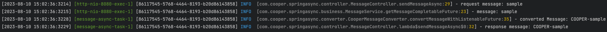

# Spring Async

## Configuration

출처 : spring **@EnableAsync** 설명

1. @Configuration 상단에 `@EnableAsync` 선언 시, spring auto-configuration 에 의해 <u>**비동기 프로세싱(async processing)**</u> 이 가능하다.
2. `@EnableAsync` 를 선언하면 기본적으로 **<u>Spring 은 연관된 스레드 풀 정의를 검색</u>**
    1. 컨텍스트에 따라 고유한 빈을 찾는다.
       - `TaskExecutor(org.springframework.core.task)`
         - Thread
       - **taskExecutor** 라는 이름의 `Executor(java.util.concurrent)`
    2. 별도의 설정이 없는 경우 비동기 메서드 호출을 처리하기 위해 `SimpleAsyncTaskExecutor(org.springframework.core.task)` 를 선언한다.
       - SimpleAsyncTaskExecutor - 요청마다 쓰레드를 생성하기 때문에 프로그램 성능에 악영향을 미치기 때문에 꼭 커스터 마이징하는 것을 추천한다.
3. `AsyncConfigurer` customization
   1. `AsyncConfigurer` interface 는 애플리케이션 컨텍스트 부트스트랩 초기에 초기화된다.
     - - 다른 빈에 대한 종속성이 필요한 경우 다른 `PostProcessor` 도 통과할 수 있도록 가능한 **Lazy** 로 선언해야 한다.
   2. `getAsyncExecutor()` 메서드를 통해 `Executor` 쓰레드 풀을 설정한다.
   3. `getAsyncUncaughtExceptionHandler()` 를 통해 `AsyncUncaughtExceptionHandler` 를 구현할 수 있다.
   
        ```java
        @Configuration
        @EnableAsync
        public class AsyncConfig implements AsyncConfigurer {
     
             @Override
             @Bean
             public Executor getAsyncExecutor() {
                 ThreadPoolTaskExecutor executor = new ThreadPoolTaskExecutor();
                 executor.setCorePoolSize(8);
                 executor.setMaxPoolSize(16);
                 executor.setQueueCapacity(100);
                 executor.setThreadNamePrefix("MyExecutor-");
                 executor.setTaskDecorator(new SimpleTaskExecutor());
                 /**
                  * - 빈으로 선언할 경우, initialize() 를 자동 호출하므로 명시할 필요없음.
                  * - initialize() : Set up the ExecutorService.
                  */
                 // executor.initialize();
                 return executor;
             }
      
             /*
              * default AsyncUncaughtExceptionHandler : SimpleAsyncUncaughtExceptionHandler 
              */
             @Bean
             @Override
             public AsyncUncaughtExceptionHandler getAsyncUncaughtExceptionHandler() {
             return new CustomAsyncExceptionHandler();
             }   
      
        }
        ```
<br>

## 2. @Async annotation

1. @Async options
   - value
     - 비동기 작업을 수행할 Executor 또는 TaskExecutor 를 bean definition 을 통해 할당할 수 있다.
2. @Async return type
   - 리턴 값이 없는 경우
     - void
   - 리턴 값이 있는 경우 ( new AsyncResult() 을 묶어서 사용)
     - Future, ListenableFuture
       -  future.get() 은 블로킹을 통해 요청 결과가 올 때까지 기다리므로 성능상 이점이 없다.
       - ListenableFuture 은 콜백을 통해 논블러킹 방식으로 작업을 처리할 수 있지만 콜백 지옥에 빠져 코드의 가독성이 떨어진다.
     - CompletableFuture
       - ListenableFuture 의 콜백 정의보다 가독성이 좋아졌으며, 논블로킹 기능을 완벽하게 수행한다. (권장)
    ```java
    @Slf4j
    @Component
    @RequiredArgsConstructor
    public class CooperMessageConverter {
    
        private static final String PREFIX = "COOPER";
    
        @Async("messageThreadPoolExecutor")
        public String convertMessage(String message) {
            log.info("received message: {}", message);
    
            if (Objects.equals(message, "exception")) {
                throw new RuntimeException("비동기 예외 발생");
            }
    
            return String.format("%s-%s", PREFIX, message);
    
        }
    
        @Async("messageThreadPoolExecutor")
        public CompletableFuture<String> convertMessageWithListenableFuture(String message) {
            log.info("received message: {}", message);
            return new AsyncResult<>(String.format("%s-%s", PREFIX, message)).completable();
        }
    }
    ```

<br>

## 3. 요청 ThreadLocal 에 있는 값을 넘기고 싶다면?

- 비동기 동작 시, 별도의 쓰레드를 할당해 이전의 ThreadLocal 에 있는 정보를 전달해주지 않는다.
- Spring 4.3 이상부터 제공되는 `TaskDecorator` 를 이용해서 비동기처리하는 taskExecutor 생성시 커스터마이징이 가능하다.
- TaskDecorator 를 상속받아 커스텀한 데코레이터를 만든 뒤, ThreadContextHolder 에 있는 값을 할당할 수 있다.
  [[참고 코드](https://github.com/pbg0205/BE-tutorials/blob/main/hibernate-multitenancy/src/main/java/com/cooper/hibernatemultitenancy/config/async/TenantAwareTaskDecorator.java)]

```java
@Configuration
@EnableAsync
public class AsyncConfig implements AsyncConfigurer {

    @Override
    @Bean
    public Executor getAsyncExecutor() {
        ThreadPoolTaskExecutor executor = new ThreadPoolTaskExecutor();
        executor.setCorePoolSize(8);
        executor.setMaxPoolSize(16);
        executor.setQueueCapacity(100);
        executor.setThreadNamePrefix("MyExecutor-");

        // 이 부분!!
        executor.setTaskDecorator(new SimpleTaskDecorator());
        return executor;
    }
}

public class SimpleTaskDecorator implements TaskDecorator {

    @Override
    public Runnable decorate(Runnable task) {
        Map<String, String> callerThreadContext = MDC.getCopyOfContextMap();
        return () -> {
            if (callerThreadContext != null) {
                MDC.setContextMap(callerThreadContext);
                task.run();
            }
        };
    }

}
```

<br>

`요청의 MDC 가 잘 전달된 것을 확인할 수 있다!!`
- MDC(Mapped Diagnostic Context)
  - Map 형식을 이용하여 클라이언트 특징적인 데이터를 저장하기 위한 메커니즘.
  - slf4j,logback,log4j2 등 Logger(로거)에서 MDC를 제공.



<br>

## References

- [제이온(우테코 3기) - [Spring] @Async 사용 방법](https://steady-coding.tistory.com/611)
- [[baeldung] How To Do @Async in Spring](https://www.baeldung.com/spring-async)
