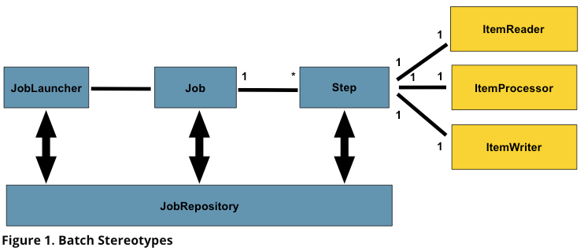
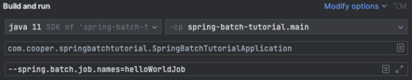

# Spring Batch

## 1. Batch Application

- 배치는 대용량의 데이터를 <u>일괄 처리를 지원하는 배치 어플리케이션</u>이다.
- 배치 어플리케이션은 5가지 조건을 만족해야 한다.
    1. **대용량 데이터** : 대량의 데이터를 가져오거나, 전달, 연산 등을 처리할 수 있어야 한다.
    2. **자동화** : 사용자의 개입없이 자동으로 실행되어야 한다.
    3. **견고성** : 잘못된 데이터를 충돌/중단 없이 처리할 수 있어야 한다.
    4. **신뢰성** : 에러가 발생한 지점을 로깅, 알림을 통해 원인을 추적할 수 있어야 한다.
    5. **성능** : 지정된 시간 안에 처리를 완료하거나 다른 어플리케이션의 방해을 받지 않고 수행되어야 한다.
- 예시 : 은행 / 가맹점 정산, 배송 실시, 이메일 쿠폰 발송, 거래 명세서 생성, 추천 시스템 데이터 작업

<br>

## 2. Spring Batch

### (1) 스프링 배치 사용의 장점
1. **풍부한 기능** : 다양한 데이터 읽기, 쓰기, 검증 제공
2. **일관적인 코드** : 빌더 패턴 기반의 일관성있는 코드를 제공하여 유지보수에 용이하다.

### (2) 배치 컴포넌트



1. `JobLauncher` : 잡을 실행시켜 주는 역할
2. `Job`
   1. 특정 기능을 묶는 단위 (e.g. 이메일 발송 잡)
   2. `Job <- JobInstance <- JobExecution` : 계층 구조를 띄고 있음.
      1. `JobInstance`
         - 논리적 작업 실행 개념(concept of logical a job run) 을 말한다. 한번 실행되어야 하는 배치 작업.
      2. `JobExecution`
         - Job 을 실행하기 위한 단일 시도에 대한 기술적 개념 (the technical concept of a single attempt to run a Job).
         - 단일 시도에 관한 property 를 갖는다. (Properties : Status, startTime, EndTime, exitStatus, createTime, lastUpdated,
            executionContext, failureExceptions)
3. `JobParameters`
   - 배치 작업을 시작하는 데 사용되는 매개변수 집합 
4. `Step` 
   - 배치 작업의 독립적이고 순차적인 단계를 캡슐화하는 도메인 객체.
      모든 Job 은 하나 이상의 단계로만 구성된다. 
   - `StepExecution`
     - Step 을 실행하려는 단일 시도를 나타냅니다.
     - Step Execution 에는 `ExecutionContext` 가 포함된다.
   - `ItemReader`
     - Step 의 입력을 나타내는 인터페이스.
     - 제공할 수 있는 입력 항목이 모두 소진되면 `null` 을 반환한다.
   - `ItemWriter`
     - Step 의 출력을 담당하는 인터페이스
   - `ItemProcessor`
     - 비즈니스 처리하는 담당하는 인터페이스
     - 항목을 처리하는 동안 해당 항목이 유효하지 않다고 판단되면 `null` 을 반환하여 기록해서는 안되는 것을 의미한다.
5. `ExecutionContext`
   - 배치 실행 전반에 걸쳐 유지해야 하는 모든 데이터가 포함된 객체
6. `JobRepository`
   - 배치 수행 관련 정보 저장소를 의미한다.
   - Job이 처음 시작될 때 리포지토리에서 JobExecution을 가져오고, 실행하는 동안 StepExecution 및 JobExecution 구현을 리포지토리로 전달하여 지속성을 유지(CRUD)한다.
7. `JobLauncher`
   - JobParameter 집합으로 작업을 시작하기 위한 간단한 인터페이스 제공
     - `public JobExecution run(Job job, JobParameters jobParameters)`
     - 구현(implementation) 은 JobRepository 에서 유효한 JobExecution 을 가져와서 Job 을 실행해야 합니다.

<br>

출처 : https://docs.spring.io/spring-batch/docs/4.3.8/reference/html/domain.html

## 3. Spring Batch Job 설정

### (1) Spring Batch Job 설정하기 위한 컴포넌트

1. `@EnableBatchProcessing` : 배치 기능 제공 및 기본 설정을 제공하기 위한 어노테이션
2. `JobBuilderFactory` : `JobRepository` 를 자동으로 설정하는 JobBuilder 팩토리 클래스 
3. `StepBuilderFactory` : `JobRepository` 와 `PlatformTransactionManager` 를 자동으로 설정하는 StepBuilder 팩토리 클래스
4. `JobParameter` 설정 : batch 를 실행하기 위해서는 program arguments 으로 —spring.batch.job.names 를 입력해야 한다. (`spring.batch.job.names`)

   

### (2) 배치 예시

#### 1. 배치 실행 시 파라미터(파일 이름) 받기 및 (csv) 검증

1. Job 선언 시, `validator()` 메서드를 통해 input 값 검증
2. `JobParameterValidator interface` 의 `validate` 메서드를 재정의한다.

- batch.validated_param package 참조

#### 2. 배치 작업 실행 전, 후 로그 추가를 위한 리스너

1. 리스너를 구현하기 위해서는 `JobExecutionListener interface` 을 구현하도록 한다.
    - void beforeJob(JobExecution jobExecution)
    - void afterJob(JobExecution jobExecution)
        - 실패시 경우에는 `jobExecution.getStatus() == BatchStatus.*FAILED`* 분기처리해서 확인할 수 있다.

- batch.job_listener package 참조

### (3) Batch Scheduling 하기

1. `@EnableScheduling` 선언
2. Component 를 생성하여 `@Scheduled(cron = "0 */1 * * * *")` 을 통해 실행할 특정 시간 설정 
3. JobLauncher 호출하여 배치 실행

```java
@Component
@RequiredArgsConstructor
public class SampleScheduler {

    private final Job helloWorldJob;
    private final JobLauncher jobLauncher;

    @Scheduled(cron = "0 */1 * * * *")
    public void helloWorldJobRun() throws JobInstanceAlreadyCompleteException, JobExecutionAlreadyRunningException, JobParametersInvalidException, JobRestartException {
        JobParameters jobParameters = new JobParameters(
                Collections.singletonMap("requestTime", new JobParameter(System.currentTimeMillis()))
        );

        jobLauncher.run(helloWorldJob, jobParameters);
    }
}
```
