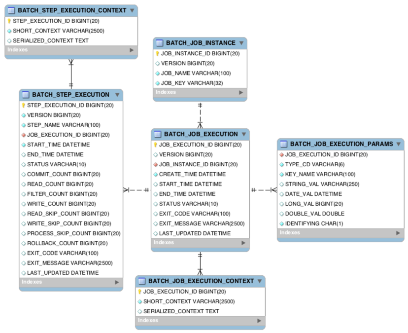

## Batch Application

- 배치는 대용량의 데이터를 일괄 처리를 지원하는 배치 어플리케이션이다.
- 배치 어플리케이션은 5가지 조건을 만족해야 한다.
    1. 대용량 데이터 : 대량의 데이터를 가져오거나, 전달, 연산 등을 처리할 수 있어야 한다.
    2. 자동화 : 사용자의 개입없이 자동으로 실행되어야 한다.
    3. 견고성 : 잘못된 데이터를 충돌/중단 없이 처리할 수 있어야 한다.
    4. 신뢰성 : 에러가 발생한 지점을 로깅, 알림을 통해 원인을 추적할 수 있어야 한다.
    5. 성능 : 지정된 시간 안에 처리를 완료하거나 다른 어플리케이션의 방해을 받지 않고 수행되어야 한다.

 

## Spring Batch

- Accenture 과 Spring Source 공동 작업을 통해 만들어진 배치 처리 프레임워크 이다.
- Spring Batch 는 Spring 에서 제공하는 기술과 연관지어 다양한 기능을 제공한다.
- Spring Quartz 는 스케줄링을 지원하는 역할이며, Spring Batch 를 상호 보완하는 역할을 한다.
    (주로 Qautz + Batch 조합을 사용한다)

| DataSource | 기술 | 설명 |
| --- | --- | ----- |
| Database | JDBC | 페이징, 커서, 일괄 업데이트 등 사용 가능 |
| Database | Hibernate | 페이징, 커서 사용 가능 |
| Database | JPA | 페이징 사용 가능 (현재 버전에서는 커서 없음) |
| File | Flat File | 지정한 구분자로 파싱 지원 (e.g. csv 파일) |
| File | XML | XML 파일 지원 |

<출처 : [[jojoldu] 1. Spring Batch 가이드 - 배치 어플리케이션이란?](https://jojoldu.tistory.com/324)>

 

## Spring Batch Metadata tables

1. 스프링 배치 메타 데이터는 배치 작업에 관한 정보와 이력을 관리하는 테이블이다.  
2. 스프링 배치는 메타 테이블이 있어야 동작한다.
   - [메타 데이터](https://getliner.com/picked-by-liner/reader-mode?url=https%3A%2F%2Fko.wikipedia.org%2Fwiki%2F%25EB%25A9%2594%25ED%2583%2580%25EB%258D%25B0%25EC%259D%25B4%25ED%2584%25B0) : 어떤 목적을 가지고 만들어진 데이터
   - H2 는 어플리케이션이 실행할 때 자동으로 생성하지만, MySQL 은 개발자가 직접 생성해야 한다.
   - spring batch schema 는 `org.springframework.batch.core` 패키지 내부에 선언되어 있다. (e.g. schema-mysql.sql)
3. 스프링 배치 메타 테이블 종류
   1. `BATCH_JOB_INSTANCE`
      - Job Parameter 에 따라 생성되는 테이블이다. 
        - Job Parameter : Spring Batch 가 실행될 때 외부에서 전달받은 파라미터이다. 만약 Job Parameter 가 같다면 기록되지 않는다.
      - Job 이 실행될 때, JobInstance 정보가 저장되며, job_name 과 job_key 를 키로 하여 하나의 데이터를 저장한다.
   2. `BATCH_JOB_EXECUTION`
      - JOB_INSTACNE 가 성공/실패에 관한 모든 내역을 관리하는 테이블이다.
      - JOB_EXECUTION 와 JOB_INSTANCE 는 부모-자식 관계이다.
      - SpringBatch 는 동일한 Job Parameter 로 성공한 기록이 있을 때만 재수행되지 않는다.
   3. `BATCH_JOB_EXECUTION_PARAMS`
   4. `BATCH_JOB_EXECUTION_CONTEXT` 
   5. `BATCH_STEP_EXECUTION` 
   6. `BATCH_STEP_EXECUTION_CONTEXT` 

## References

- [[jojoldu] 1. Spring Batch 가이드 - 배치 어플리케이션이란?](https://jojoldu.tistory.com/324)
- [Spring Batch - Reference Documentation - Spring Batch Introduction](https://docs.spring.io/spring-batch/docs/current/reference/html/spring-batch-intro.html#spring-batch-intro)
