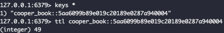
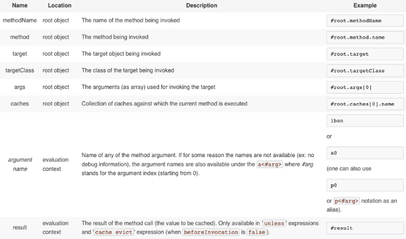

# Cache Abstraction in Spring

## Index

- Cache Abstarction
- Declarative Annotation-based Caching
- Custom Key Generation Declaration

## Cache Abstarction

---

1. Spring Framework 3.1 이후부터 제공하는 캐싱 추상화 기능이 제공되었다.

2. Spring Framework 4.1 에는 JCache
   표준([JSR-107 annotation](https://docs.spring.io/spring-framework/docs/current/reference/html/integration.html#cache-jsr-107))
   어노테이션을 지원하고 사용자 구성 커스터마이징을 지원하면서 기능이 확장되었다.

    1. Spring AOP 를 기반으로 한 어노테이션 방식을 사용하면 부가적인 캐싱을 위한 사전 작업 또는 커넥션 종료 로직을 추가하지 않고 캐싱하고자하는 로직만을 명시하여 수행하여 로직을 작성할 수 있다.

3. **Cache vs Buffer**

   > 버퍼는 다른 전송 속도를 완충하기 위해 데이터를 저장하는 메모리 영역이고, 캐시는 반복적으로 반환하는 동일한 데이터를 메모리 영역에 저장하는 것을 말한다.

    - Buffer
        1. 데이터를 한 곳에서 다른 한 곳으로 전송하는 동안 일시적으로 그 데이터를
           보관하는 [메모리](https://ko.wikipedia.org/wiki/%EB%A9%94%EB%AA%A8%EB%A6%AC)의
           영역이다. ([ref. wikipedia.buffer](https://ko.wikipedia.org/wiki/%EB%B2%84%ED%8D%BC_(%EC%BB%B4%ED%93%A8%ED%84%B0_%EA%B3%BC%ED%95%99)))
        2. 데이터는 버퍼에서 한 번만 읽고 쓰며, 버퍼는 데이터를 전달받는 주체가 있기 때문에 다른 당사자에게
           보여진다. ([ref. wikipedia.cache](https://ko.wikipedia.org/wiki/%EC%BA%90%EC%8B%9C))
    - Cache
        1. 데이터나 값을 미리 복사해 놓는 임시 장소를 가리킨다.
        2. 캐시의 접근 시간에 비해 원래 데이터를 접근하는 시간이 오래 걸리는 경우나 값을 다시 계산하는 시간을 절약해 빠르게 데이터에 접근할 수 있다.

<br>

## cache strategy

1. 캐시 읽기 전략(Read Cache Strategy)
    - Look Aside pattern - 데이터를 찾을 때 우선 캐시에 저장된 데이터가 있는지 우선 확인하는 전략
    - Read Through pattern - 캐시에서만 데이터를 읽어오는 전략. 데이터가 없을 경우, DB 에서 조회
2. 캐시 쓰기 전략 (Write Cache Strategy)
   - Write Behind pattern - 데이터 저장 시, DB에 바로 쿼리하지 않고 캐시에 모아서 일정 주기 배치 작업으로 DB 반영
   - Write Through pattern - 데이터를 저장할 때 먼저 캐시에 저장한 다음 바로 DB에 저장

<br>

## cache Configuration (redis)

### java configuration

```java

@EnableCaching
@Configuration(proxyBeanMethods = false)
public class RedisCacheConfig {

    private static final String COOPER_CACHE_PREFIX = "cooper_";

    @Bean
    public CacheManager redisCacheManager(RedisConnectionFactory redisConnectionFactory) {
        return RedisCacheManager
                .RedisCacheManagerBuilder
                .fromConnectionFactory(redisConnectionFactory)
                .cacheDefaults(defaultConfiguration())
                .withInitialCacheConfigurations(customConfigurationMap())
                .build();
    }

    private RedisCacheConfiguration defaultConfiguration() {
        return RedisCacheConfiguration.defaultCacheConfig()
                .serializeKeysWith(fromSerializer(new StringRedisSerializer()))
                .serializeValuesWith(fromSerializer(new GenericJackson2JsonRedisSerializer()))
                .prefixCacheNameWith(COOPER_CACHE_PREFIX)
                .disableCachingNullValues()
                .entryTtl(Duration.ofSeconds(20));
    }

    private Map<String, RedisCacheConfiguration> customConfigurationMap() {
        Map<String, RedisCacheConfiguration> customConfigurationMap = new HashMap<>();

        for (RedisCacheTTL cacheTTL : RedisCacheTTL.values()) {
            customConfigurationMap.put(cacheTTL.getCacheName(), defaultConfiguration().entryTtl(cacheTTL.getTtl()));
        }

        return customConfigurationMap;
    }

}

@Getter
@RequiredArgsConstructor
public enum RedisCacheTTL {

    BOOK("book", Duration.ofSeconds(60)),
    PHONE("phone", Duration.ofSeconds(1000));

    private final String cacheName;
    private final Duration ttl;

}

```

<br>

### properties

- https://docs.spring.io/spring-boot/docs/current/reference/html/application-properties.html#appendix.application-properties.cache

| name                                 | Description                                       | default value |
|--------------------------------------|---------------------------------------------------|---------------|
| spring.cache.cache-names             | comma(,)를 기준으로 cache manager 가 지원하는 cache name 설정 |               |
| spring.cache.redis.cache-null-values | value 로 null 값 허용 한다.                             | true          |
| spring.cache.redis.key-prefix        | key prefix 선언                                     |               |
| spring.cache.redis.time-to-live      | 만료 시간 설정                                          | 만료 시간 없음      |

<br>

## Declarative Annotation-based Caching

---

1. `@Cacheable`
    - 메서드에 캐싱된 데이터 존재 유무를 판별하여 존재할 경우, 캐시의 데이터를 반환하고 데이터가 존재하지 않을 경우, 캐시에 데이터를 추가한다.
    - 만약 캐싱된 데이터가 존재할 경우 메서드를 실행하지 않고 캐싱된 데이터를 결과로 반환한다.
2. `@CacheEvict`
    - 메서드가 실행될 때 해당 네이밍 키값의 캐싱 데이터를 제거한다.
3. `@CachePut`
    - 실행 결과를 캐시해 저장하지만, 조회 시 저장된 캐시의 내용을 사용하지 않고 항상 메서드 로직을 실행한다.
4. `@Caching`
    - 메서드에 적용할 여러 캐시 작업을 다시 그룹화합니다.
5. `@CacheConfig`
    - 클래스 수준에서 몇 가지 일반적인 캐시 관련 설정을 공유합니다.

<br>

## Custom Key Generation Declaration

---

```java
@Cacheable(key = "#bookId", cacheNames = {"book"}, condition = "#bookId != null")
public BookLookupResponseDto findBookById(String bookId){}

@CacheEvict(key = "#bookId", cacheNames = "book")
public void deleteBookById(String bookId){}
```



- key 값 형태: `[prefix][cacheName]::[key]`
- type: `string`

- key option 추가하면 해당 키를 기준으로 데이터를 저장한다.
- key 옵션은 [SpEL](https://docs.spring.io/spring-framework/docs/3.2.x/spring-framework-reference/html/expressions.html)을
  사용한다.

<br>

## Conditional caching

---

```java
@Cacheable(cacheName = "book", condition = "#name.length < 32", unless = "#result.hardback")
public Book findBook(String name)
```

- condition option을 추가하면 특정 조건을 만족할 경우에만 값을 캐싱한다.

    - 참고: unless 에 캐싱이 되지 않는 경우, IllegalArgumentException 을 발생한다.

      ([https://blog.leocat.kr/notes/2022/05/05/redis-avoid-store-null-value](https://blog.leocat.kr/notes/2022/05/05/redis-avoid-store-null-value))

- Cache SpEL available metadata

  

<br>

## @Cacheable 적용 후 속도 차이

---

Post 캐싱 후 응답 속도 확인

```
# 캐싱 적용 전, 응답 속도 : 329ms
[210cf175-c0ac-4b0b-a4ec-9622165e51ce] request URL: /api/v1/posts/ff8080818281107201828110d7c80000, request method: GET
[210cf175-c0ac-4b0b-a4ec-9622165e51ce] target: com.cooper.cooperposts2022.posts.application.PostLookupServiceImpl, arguments: [ff8080818281107201828110d7c80000]
[210cf175-c0ac-4b0b-a4ec-9622165e51ce] target: com.cooper.cooperposts2022.posts.ui.PostLookupController@63ed5dae, elapsed milli time : 329
[210cf175-c0ac-4b0b-a4ec-9622165e51ce] returnCode: 200, responseBody: PostLookupResponseDto(id=ff8080818281107201828110d7c80000, title=제목1, content=내용1, author=cooper, questions=[])

# 캐싱 적용 후, 응답 속도 : 4ms
[e11066d9-05d0-4401-90c2-cc4b7dad360a] request URL: /api/v1/posts/ff8080818281107201828110d7c80000, request method: GET
[e11066d9-05d0-4401-90c2-cc4b7dad360a] target: com.cooper.cooperposts2022.posts.ui.PostLookupController@63ed5dae, elapsed milli time : 4
[e11066d9-05d0-4401-90c2-cc4b7dad360a] returnCode: 200, responseBody: PostLookupResponseDto(id=ff8080818281107201828110d7c80000, title=제목1, content=내용1, author=cooper, questions=[])
```

<br>

## 캐싱 동기화

---

```java
@Cacheable(cacheNames = "foos", sync = true)
public Foo executeExpensiveOperation(String id){...}
```

- 다중 스레드 환경일 경우 동시 호출이 있을 수 있다. 기본 캐시 추상화는 락을 하지 않는다. 일반적으로 레디스는 싱글 스레드 환경이기 때문에 원자성을 보장하지만
  **클러스터링 환경일 경우 원자성을 보장하지 못할 수 있어 이 점을 유의해야 한다.**
- 캐싱 추상화는 sync 속성을 제공한다. 값이 계산되는 동안 캐시 항목을 잠구도록 캐시 제공자에게 지시할 수 있다.

<br>

### Reference

---

- [개념정리] 버퍼(BUFFER)란? 버퍼 개념 : [https://dololak.tistory.com/84](https://dololak.tistory.com/84)
- [Spring] Cache
  Abstraction : [https://docs.spring.io/spring-framework/docs/3.2.x/spring-framework-reference/html/cache.html](https://docs.spring.io/spring-framework/docs/3.2.x/spring-framework-reference/html/cache.html)
- [Spring] 캐시(Cache) 추상화와 사용법(@Cacheable, @CachePut,
  @CacheEvict) : [https://mangkyu.tistory.com/179](https://mangkyu.tistory.com/179)
