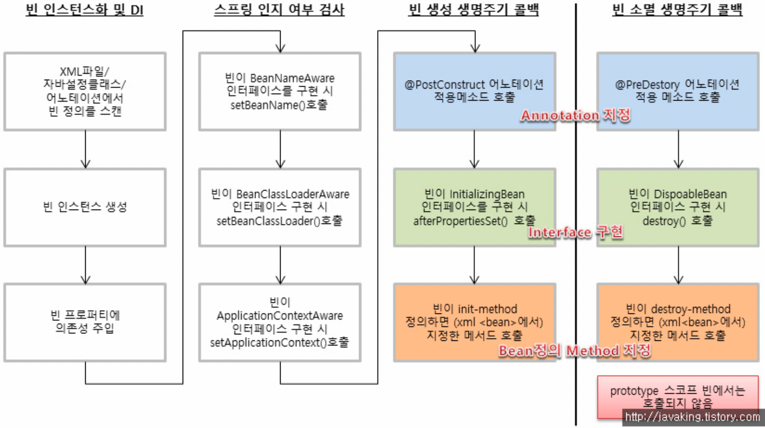

# Spring Core summary

## preview. bean life cylcle

## [1] 빈 초기화, 소멸  메서드



**생성 순서**
1. constructor (constructor 생성 이후 BeanNameAware.setBeanName() 호출)
2. @PostConstruct
3. BeanNameAware(afterPropertiesSet())
4. @Bean 선언 initMethod 호출 
```text
2022-12-11 19:34:16.233 DEBUG 5596 --- [           main] o.s.b.f.s.DefaultListableBeanFactory     : Creating shared instance of singleton bean 'memberBean'
2022-12-11 19:34:16.233 TRACE 5596 --- [           main] o.s.b.f.s.DefaultListableBeanFactory     : Creating instance of bean 'memberBean'
2022-12-11 19:34:16.233 TRACE 5596 --- [           main] o.s.b.f.s.DefaultListableBeanFactory     : Returning cached instance of singleton bean 'memberConfig'
2022-12-11 19:34:16.241 DEBUG 5596 --- [           main] c.e.springcore.member.beans.MemberBean   : com.example.springcore.member.beans.MemberBean 생성자 초기화
2022-12-11 19:34:16.242 DEBUG 5596 --- [           main] c.e.springcore.member.beans.MemberBean   : com.example.springcore.member.beans.MemberBean setBeanName() 메서드 동작 memberBean
2022-12-11 19:34:16.242 DEBUG 5596 --- [           main] c.e.springcore.member.beans.MemberBean   : com.example.springcore.member.beans.MemberBean @postConstruct 메서드 동작
2022-12-11 19:34:16.242 TRACE 5596 --- [           main] o.s.b.f.s.DefaultListableBeanFactory     : Invoking afterPropertiesSet() on bean with name 'memberBean'
2022-12-11 19:34:16.242 TRACE 5596 --- [           main] o.s.b.f.s.DefaultListableBeanFactory     : Invoking init method  'initMethod' on bean with name 'memberBean'
2022-12-11 19:34:16.243 TRACE 5596 --- [           main] o.s.b.f.s.DefaultListableBeanFactory     : Finished creating instance of bean 'memberBean'
```

### (1) InitializingBean, DisposableBean
- **InitializingBean** : afterPropertiesSet() 메서드 내부에 로직을 작성하면 빈을 생성하고 해당 로직이 동작한다.
- **DisposableBean** : destroy() 메서드 내부에 로직을 작성하면 빈을 소멸하기 이전에 해당 로직이 동작한다. 
```java
@Log4j2
@Component
public class MemberComponent implements InitializingBean, DisposableBean, BeanNameAware {

    @Override
    public void afterPropertiesSet() throws Exception {
        //빈 초기화 시, 작동하는 비즈니스 로직
        log.debug("{} {}", MemberComponent.class.getName(), "afterPropertiesSet() 메서드 동작");
    }

    @Override
    public void destroy() throws Exception {
        //빈 소멸 시, 작동하는 비즈니스 로직
        log.debug("{} {}", MemberComponent.class.getName(), "destroy() 메서드 동작");
    }

}

```

<br>

## 2. @PostConstruct, @PreDestroy
- `@PostConstruct` : 빈 내부 해당 어노테이션 선언 시, 빈 초기화 이후 해당 메서드 동작
- `@PreDestroy` : 빈 내부 해당 어노테이션 선언 시, 빈 소멸 이전 해당 메서드 동작

```java
@Log4j2
@Component
public class MemberComponent implements InitializingBean, DisposableBean, BeanNameAware {

    @PostConstruct
    public void postConstruct() {
        //빈 초기화 시, 작동하는 비즈니스 로직
        log.debug("{} {}", MemberBean.class.getName(), "@postConstruct 메서드 동작");
    }

    @PreDestroy
    public void preDestroy() {
        //빈 초기화 시, 작동하는 비즈니스 로직
        log.debug("{} {}", MemberBean.class.getName(), "@preDestroy 메서드 동작");
    }

}
```

<br>

### (3) initMethod, destroyMethod
- initMethod : 빈 내부 특정 메서드 이름 선언 시, 빈 초기화 이후 해당 메서드 동작 (private 메서드도 동작)
- destroyMethod : 빈 내부 특정 메서드 이름 선언 시, 빈 소멸 이전 해당 메서드 동작 (private 메서드도 동작)
```java
@Configuration
public class MemberConfig {

    @Bean(initMethod = "initMethod", destroyMethod = "destroyMethod")
    public MemberBean memberBean() {
        return new MemberBean();
    }

}

@Slf4j
public class MemberBean implements InitializingBean, DisposableBean, BeanNameAware {

    private void initMethod() {
        log.debug("{} {}", MemberBean.class.getName(), "initMethod() 메서드 동작");
    }

    private void destroyMethod() {
        log.debug("{} {}", MemberBean.class.getName(), "destroyMethod() 메서드 동작");
    }
    
}

```

<br>


### (4) ApplicationListener<ContextRefreshedEvent>
- Spring Context 가 초기화가 완료되고 이후 로직을 실행하기 위해 이 접근 방식을 사용한다.
- tomcat 이 실행된 이후에 ApplicationListener.onApplicationEvent(ContextRefreshedEvent event) 메서드를 실행한다.
- 해당 메서드의 이벤트는 **@EventListener** 를 통해서 전달받아 동작한다.
- context 가 모두 초기화가 완료된 상태이기 때문에 컨텍스트 실행 후, 추가할 데이터를 넣어도 좋을 것 같다.  


```java
@Slf4j
@Component
public class StartupApplicationListenerExample implements ApplicationListener<ContextRefreshedEvent> {

    @Override
    public void onApplicationEvent(ContextRefreshedEvent event) {
        log.debug("{} {}",
                StartupApplicationListenerExample.class.getName(),
                "onApplicationEvent(ContextRefreshedEvent event) 선언"
        );
        log.debug("{}", event.getSource());
    }

}

@Slf4j
@Component
public class EventListenerExampleBean {

    @EventListener
    public void onApplicationEvent(ContextRefreshedEvent event) {
        log.debug("{} {}",
                EventListenerExampleBean.class.getName(),
                "onApplicationEvent(ContextRefreshedEvent event) 선언"
        );
        log.debug("{}", event.getSource());
    }

}

```

<br>

### References

- [baeldung] Guide To Running Logic on Startup in Spring : https://www.baeldung.com/running-setup-logic-on-startup-in-spring


## 2. Internationalization (i18n)

- internalization
  - 소스 코드의 변경없이 다국어 언어를 지원하는 것을 말한다.
  - 다국어 메세지는 어플리케이션 외부에서 관리되며 런타임 시에 추가된다.  
  - 날짜 및 통화와 관련된 데이터는 최종 사용자의 지역 및 언어 형식으로 표시된다.
- localization
  - 지역별 텍스트 또는 구성 요소를 추가하여 국제화된 어플리케이션 특정 언어 및 지역에 맞게 조정하는 프로세스를 말한다.
  - 새로운 언어에 대한 지원을 추가할 때마다 언어 파일과 지역별 콘텐츠를 추가하는 프로세스이다.

### (1) LocaleResolver

- locale 설정을 지원하는 **org.springframework.web.servlet** 패키지에 위치한 인터페이스이다.
- locale 은 accept-language header, cookie, session 등을 통해 locale 을 설정한다.
    - **LocaleResolver interface** 의 기본 구현체는 `AcceptHeaderLocaleResolver` 이다. 
      해당 Resolver 는  **accept-language** header 를 통해서 locale 을 설정하는 resolver 이다.

<br>

[추가 샘플 코드 필요]

- Locale 을 세션에 추가했을 때 session 만료 시간을 설정하는 방법?

## References

- [[reflectoring] How to Internationalize a Spring Boot Application](https://reflectoring.io/spring-boot-internationalization/)
