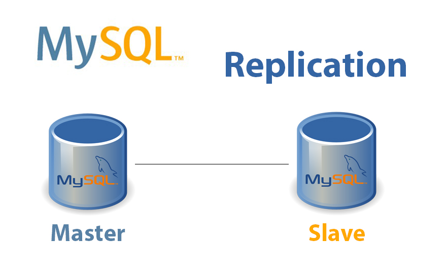
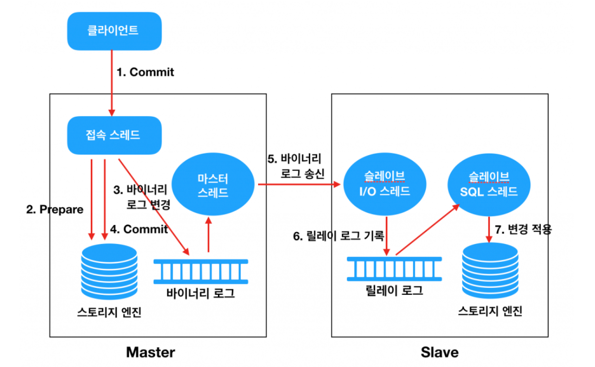
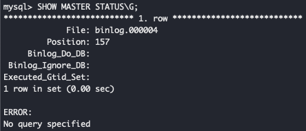
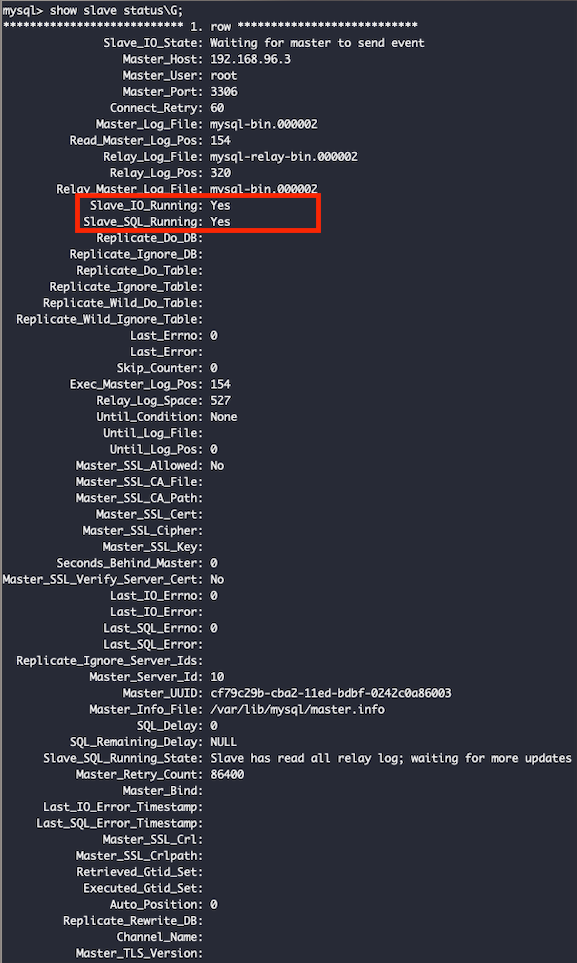

# multi datasource practice

# Requirements

- [x] Master-Slave Replica 구조를 통해서 DB 요청을 분산한다.
  - [x] Command(CREATE, UPDATE, DELETE) 의 경우, Master 에서 작업한다.
  - [x] Query(READ) 의 경우, Slave 에서 작업한다.
- [x] 학생 CRUD API 를 작성한다.
- [x] docker 를 통해서 Master-Slave 구조를 구성한다.

<br>

## Preview

### (1) Master - Slave 구조?



- `Master - Slave Replication` 은 Command 를 Master 서버로, Query 을 Slave 서버로 구성하는 방법이다.
- 이와 같은 복제 구조를 구성하는 이유는 DB 트래픽을 분산시키기 위한 목적으로 사용된다.
- MySQL 의 경우, Master 와 Slave 를 동기화하기 위해서 바이너리 로그를 통해 데이터를 동기화 한다.
  
  (바이너리 로그: MySQL 서버 인스턴스의 데이터 변경사항들에 대한 정보를 포함하는 로그 파일의 세트)

### (2) MySQL Replication 동작 원리

(출처 : [MySQL – Replication 구조](http://cloudrain21.com/mysql-replication))



- MySQL 의 Replication 은 기본적으로 비동기 복제 방식을 사용
- 동작 방식 
  1. 클라이언트(Application)에서 Commit 을 수행한다. 
  2. Connection Thead 는 스토리지 엔진에게 해당 트랜잭션에 대한 Prepare(Commit 준비)를 수행한다. 
  3. Commit 을 수행하기 전에 먼저 Binary Log 에 변경사항을 기록한다. 
  4. 스토리지 엔진에게 트랜잭션 Commit 을 수행한다. 
  5. Master Thread 는 시간에 구애받지 않고(비동기적으로) Binary Log 를 읽어서 Slave 로 전송한다. 
  6. Slave 의 I/O Thread 는 Master 로부터 수신한 변경 데이터를 Relay Log 에 기록한다. (기록하는 방식은 Master 의 Binary Log 와 동일하다)
  7. Slave 의 SQL Thread 는 Relay Log 에 기록된 변경 데이터를 읽어서 스토리지 엔진에 적용한다.

<br>

## 1. MySQL Master - Slave 구성

### (1) docker-compose 를 통한 Master - Slave 구성

1. docker-compose 를 통한 mysql(ver.5.7) master, slave 생성
2. docker network 를 통한 master, slave 통신 (이후에 추가 언급)

```yaml
version: '3.9'

services:
  master_db:
    image: mysql:5.7
    container_name: master_db
    ports:
      - "3306:3306"
    volumes:
      - ./master_db/var/lib/:/var/lib/
      - ./master_db/var/lib/mysql-files/:/var/lib/mysql-files/
#      - ./master_db/etc/:/etc/
    environment:
      MYSQL_ROOT_PASSWORD: 'cooper2021'
      MYSQL_DATABASE: cooper_db
    command:
      - --character-set-server=utf8mb4
      - --collation-server=utf8mb4_unicode_ci
    networks:
      - net-mysql
  slave_db:
    image: mysql:5.7
    container_name: slave_db
    ports:
      - "3307:3306"
    volumes:
      - ./slave_db/var/lib/mysql-files/:/var/lib/mysql-files/
      - ./slave_db/var/lib/:/var/lib/
#      - ./slave_db/etc/:/etc/
    environment:
      MYSQL_ROOT_PASSWORD: 'cooper2021'
      MYSQL_DATABASE: cooper_db
    command:
      - --character-set-server=utf8mb4
      - --collation-server=utf8mb4_unicode_ci
    networks:
      - net-mysql


networks:
  net-mysql:
    driver: bridge

```


<br>

## 2. Master - Slave 구성

### (1) master - slave 를 통신을 구축하기 위해 master 내부 ip 탐색

- `docker network ls` : network container id 를 확인하기 위함.
- `docker inspect [container_id]` : docker container, network 의 세부 정보를 확인하기 위함.
<details title="docker inspect 내용">

 ```json
 [
     {
         "Name": "docker_net-mysql",
         "Id": "4ae8d9753d0a57c290d4a2907a88fb8b3959a7798539e0ee50092b711d019779",
         "Created": "2023-03-25T12:35:02.521457Z",
         "Scope": "local",
         "Driver": "bridge",
         "EnableIPv6": false,
         "IPAM": {
             "Driver": "default",
             "Options": null,
             "Config": [
                 {
                     "Subnet": "172.30.0.0/16",
                     "Gateway": "172.30.0.1"
                 }
             ]
         },
         "Internal": false,
         "Attachable": true,
         "Ingress": false,
         "ConfigFrom": {
             "Network": ""
         },
         "ConfigOnly": false,
         "Containers": {
             "4e0614ca335b05e6d2825cb46080cbb0fcf2b3e5865a5dba13a41e46083c3634": {
                 "Name": "slave_db",
                 "EndpointID": "9570890b5b43a1a9281c9564d4b9a25f53484b4936b2ed83cfb426168f414235",
                 "MacAddress": "02:42:ac:1e:00:02",
                 "IPv4Address": "172.30.0.2/16", // slave 내부 ip
                 "IPv6Address": ""
             },
             "66f95ef9ad3e9b6e27486506f8920e5a01064918e110e869ad3851db4ff20af2": {
                 "Name": "master_db",
                 "EndpointID": "a2105b7a3c3b7fc95cdad70740eb54619fcc5bfd5b27389aea63624c4c8b61f8",
                 "MacAddress": "02:42:ac:1e:00:03",
                 "IPv4Address": "172.30.0.3/16", // master 내부 ip (이거 꼭 기억)
                 "IPv6Address": ""
             }
         },
         "Options": {},
         "Labels": {
             "com.docker.compose.network": "net-mysql",
             "com.docker.compose.project": "docker",
             "com.docker.compose.version": "1.29.2"
         }
     }
 ]
 ```

</details>

<br>

### (2) master, slave db my.cnf 파일 설정

- 파일 위치 : /etc/my.cnf
- master my.cnf 내용 추가 -> 추가 후, container 재시작
  ```
  server_id = 10
  log_bin = mysql-bin
  relay_log = /var/lib/mysql/mysql-relay-bin
  ```
- slave my.cnf 내용 추가
  ```
  server_id = 11
  log_bin = mysql-bin
  relay_log = /var/lib/mysql/mysql-relay-bin\
  log_slave_updates
  read_only
  ```

<br>

### (3) master db 에서 MASTER_LOG_FILE, MASTER_LOG_POS 확인

```sql
SHOW MASTER STATUS\G;
```



<br>

### (4) slave db 에서 master db 설정

```sql
-- Master DB 설정
CHANGE MASTER TO \
MASTER_HOST='192.168.96.3', \
MASTER_PORT=3306, \
MASTER_USER='root', \
MASTER_PASSWORD='cooper2021', \
MASTER_LOG_FILE='mysql-bin.000002', \ # 3번에서 확인했던 LOG_FILE
MASTER_LOG_POS=154; # 3번에서 확인했던 LOG_POS

-- start slave
start slave;
```

<br>

### (5) master - slave 정상 연결 확인

- slave db 에서 mysql client 접속하여 확인
- `Slave_IO_Running: Yes`, `Slave_SQL_Running: Yes`



<br>

## 3. API 작성하기

### (1) DataSourceRouting 설정하기

- `AbstractRoutingDataSource` 하위 구현체를 작성하여 라우팅하기 위한 조건 추가
  - default_datasource, target_datasource 설정
- Transaction readOnly option 에 따라 master-slave 구분하도록 java config 설정

```java
@Configuration
@EnableTransactionManagement
public class DataSourceRoutingConfiguration {

    private static final String MASTER_DATA_SOURCE = "masterDataSource";
    private static final String SLAVE_DATA_SOURCE = "slaveDataSource";
    private static final String MASTER_KEY = "master";
    private static final String SLAVE_KEY = "slave";
    private static final String ROUTING_DATA_SOURCE = "routingDataSource";
    private static final String LAZY_CONNECTION_DATA_SOURCE_PROXY = "lazyConnectionDataSourceProxy";

    @Bean(MASTER_DATA_SOURCE)
    @ConfigurationProperties(prefix = "spring.datasource.hikari.master")
    public DataSource masterDataSource() {
        return DataSourceBuilder.create()
                .type(HikariDataSource.class)
                .build();
    }

    @Bean(SLAVE_DATA_SOURCE)
    @ConfigurationProperties(prefix = "spring.datasource.hikari.slave")
    public DataSource slaveDataSource() {
        return DataSourceBuilder.create()
                .type(HikariDataSource.class)
                .build();
    }

    @Bean
    @DependsOn({MASTER_DATA_SOURCE, SLAVE_DATA_SOURCE})
    public DataSource routingDataSource(
            @Qualifier(MASTER_DATA_SOURCE) DataSource masterDataSource,
            @Qualifier(SLAVE_DATA_SOURCE) DataSource slaveDataSource
    ) {
        RoutingDataSource routingDataSource = new RoutingDataSource();

        Map<Object, Object> dataSourceMap = new HashMap<>();;
        dataSourceMap.put(MASTER_KEY, masterDataSource);
        dataSourceMap.put(SLAVE_KEY, slaveDataSource);

        routingDataSource.setDefaultTargetDataSource(masterDataSource);
        routingDataSource.setTargetDataSources(dataSourceMap);

        return routingDataSource;
    }

    @Primary
    @Bean(LAZY_CONNECTION_DATA_SOURCE_PROXY)
    @DependsOn(ROUTING_DATA_SOURCE)
    public DataSource lazyConnectionDataSourceProxy(
            @Qualifier(ROUTING_DATA_SOURCE) DataSource routingDataSource) {
        return new LazyConnectionDataSourceProxy(routingDataSource);
    }

    @Primary
    @Bean
    public LocalContainerEntityManagerFactoryBean entityManagerFactory(
            @Qualifier(LAZY_CONNECTION_DATA_SOURCE_PROXY) DataSource dataSource) {
        LocalContainerEntityManagerFactoryBean em = new LocalContainerEntityManagerFactoryBean();
        em.setJpaVendorAdapter(new HibernateJpaVendorAdapter());
        em.setDataSource(dataSource);
        em.setPackagesToScan("com.cooper.springdatajpamultidatasource.student.domain");
        return em;
    }

    static class RoutingDataSource extends AbstractRoutingDataSource {

        @Override
        protected Object determineCurrentLookupKey() {
            return (TransactionSynchronizationManager.isCurrentTransactionReadOnly()) ? SLAVE_KEY : MASTER_KEY;
        }

    }

}

```

### 2. API 테스트

1. 학생 생성 (`POST` /api/student)

- master


- slave


2. 학생 조회 (`GET` /api/student/{studentId})

- master


- slave


3. 학생 수정 (`PUT` /api/student)

- master


- slave


4. 학생 삭제 (`DELETE` /api/student/{studentId})

- master


- slave


<br>

## References

- [mysql master-slave docker 설정 방법](https://huisam.tistory.com/entry/mysql-replication)
- [datasource routing 설정 방법](https://k3068.tistory.com/102#AbstractRoutingDataSource%20Bean%20%EB%93%B1%EB%A1%9D%ED%95%98%EA%B8%B0-1)
- [바이너리 로그에 관한 이해](https://jins-dev.tistory.com/entry/MySQL-%EB%B0%94%EC%9D%B4%EB%84%88%EB%A6%AC-%EB%A1%9C%EA%B7%B8binlog%EC%97%90-%EB%8C%80%ED%95%9C-%EC%9D%B4%ED%95%B4)

## Further Study

- [ ] 배포 환경에서 설정하는 방법?
- [ ] my.cnf 수동 설정없이 하는 방법? (Dockerfile)
- [ ] 번외. 2PC 트랜잭션 해결법? -> 보상 트랜잭션, 사가 패턴??
