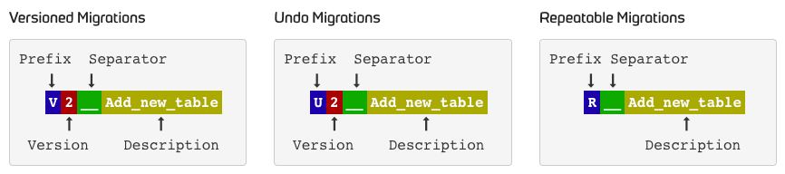

# flyway

## 프로젝트 환경

- Java 11
- MySQL 8.0
- SpringBoot

## flyway 를 사용하는 이유

1. 오픈 소스 DB migration tool 이며, DB 형상 관리를 위한 도구로 사용한다.
2. 운영 환경에서는 spring.jpa.hibernate.ddl-auto 를 `validate` 를 사용하기 때문에 일일이 SQL 을 작성할 경우 휴먼 에러가 발생할 가능성이 높다.
   - 운영 환경에서 craete, create-drop 을 사용하면 운영환경의 DB 가 날라간다.. update 를 사용하는 것도 스키마 변겨엥 관한 추적이 어려워 권장하지 않는 사항인 것으로 알고 있다.
3. 이 때, DB 형상관리 도구를 사용하면 스키마 버전 관리 및 변경 사항을 추적할 수 있어 쉽고 안전하게 변경이 가능하다.

<br>

## Naming


(출처 : [flyway document](https://flywaydb.org/documentation/concepts/migrations#naming-1))
- 네이밍은 크게 prefix + separator + description 으로 구분된다.

### Prefix : V, U, R 을 기억하자.

  - V(Versioned) : 현재 버전을 새로운 버전으로 업데이트 하는 경우
  - U(Undo) : 현재 버전을 이전 버전으로 롤백하는 경우
  - R(Repeatable) : 버전에 관계없이 매번 실행하는 경우

### 주의사항

- Versioned 와 Undo 로 작성할 경우 버전을 명시해야 하고 Repeatable 의 경우 버전을 명시하지 않는다.
- 새로운 스크립트는 작성할 경, 스크립트 버전을 이전 버전보다 높게 적어야 한다. 만약 낮은 숫자를 명시할 경우 Flyway 는 이를 무시하고 적용되지 않는다.
- Separator 는 무조건 언더바 2개(`__`) 로 작성해야 한다.
- Description 은 스크립트에 관한 내용을 의미하며 자유롭게 작성한다. 단어의 구분은 언더바 1개(`_`)를 사용한다.


### Naming example

- V1_init.sql
- V1.1__add_member_sample_data.sql
- V20230102_add_member_phone_number_colum.sql

<br>

## 적용 방법

### build.gradle

```groovy
dependencies {
	implementation 'org.flywaydb:flyway-core'
}
```

### application.yml
```yaml

spring:
  datasource:
    driver-class-name: com.mysql.cj.jdbc.Driver
    url: jdbc:mysql://localhost:3306/cooper_db
    username: root
    password: cooper2021

  flyway:
    enabled: true # flyway 사용여부 (default: true)
    baseline-on-migrate: true # baseline 설정
    baseline-version: 1 # baseline-version 시작 행을 설정할 수 있다.
    url: jdbc:mysql://localhost:3306/cooper_db
    user: root
    password: cooper2021
    locations: classpath:db/migration # 저장 script 파일 위치 (default: classpath:db/migration)

  jpa:
    generate-ddl: false # DDL 생성 여부
    open-in-view: false # openEntityManagerInterceptor 활성화 금지
    hibernate:
      ddl-auto: validate
      use-new-id-generator-mappings: false # hibernate id 생성 전략을 그대로 사용 (e.g. AUTO, SEQUENCE)
    show-sql: true # sql 출력
    properties:
      hibernate:
        enable_lazy_load_no_trans: true
        format_sql: true
        dialects: org.hibernate.dialect.MySQL57Dialect

```

### properties

1. `spring.flyway.enabled`
   - spring 에서 flyway 를 사용할지 여부를 결정하는 프로퍼티
   - default value : true
   
2`spring.flyway.baseline-on-migrate`
   - 기존 테이블 정보, 데이터는 있고 `flyway_schema_history` 테이블에는 없는 경우에 주로 사용한다.
   - 기존에 database 가 존재하는 상황에서 도중에 Flyway 를 도입할 떄 유용하게 사용된다.
     - 프로젝트 도중에 flyway를 적용하는 방법 (ref: [Flyway DB 마이그레이션 / 기존 데이터가 있는 상황에서 Flyway 적용하기](https://www.blog.ecsimsw.com/entry/Flyway-DB-%EB%A7%88%EC%9D%B4%EA%B7%B8%EB%A0%88%EC%9D%B4%EC%85%98-%EA%B8%B0%EC%A1%B4-%EB%8D%B0%EC%9D%B4%ED%84%B0%EA%B0%80-%EC%9E%88%EB%8A%94-%EA%B2%BD%EC%9A%B0))
       1. `spring.flyway.baseline-on-migrate = true` 로 설정
       2. `spring.flyway.locations` 선언 위치에 빈 script 파일을 작성
          (빈 파일이어도, V1 에 해당하는 파일 자체는 있어야 함.)
       
3. `spring.flyway.locations`
   - flyway script 를 저장하는 장소를 명시하는 프로퍼티
   - default value : main/java/resources/db/migration
   
<br>

### References

- [[SpringBoot reference] 9.5.1 Execute Flyway Database Migrations on Startup](https://docs.spring.io/spring-boot/docs/current/reference/html/howto.html#howto.data-initialization.migration-tool.flyway)
