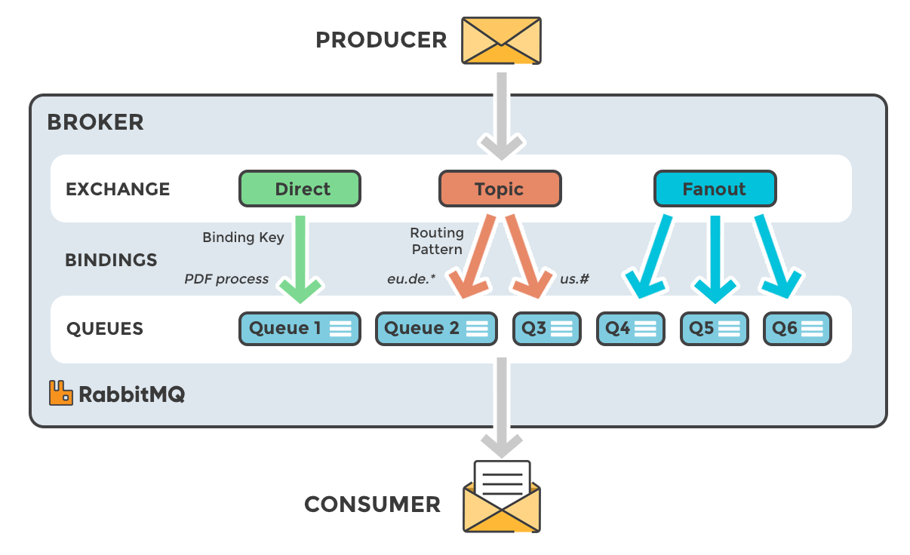
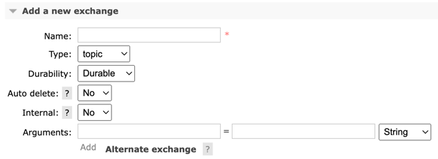

## rabbitmq architecture



1. producer : 메세지를 송신하는 주체
2. exchange : producer 로 부터 전달받은 메시지를 queue 에게 전달하는 역할
3. binding : exchange 와 queue 를 연결하여 queue 에 보낼 메시지를 필터링한다.
4. queue : message 가 적재되어 consumer 에게 전달하기 위한 저장소
5. consumer : 메시지를 전달받는 주체

## exchange 속성 값



- Type : exchange type (direct, topic, fanout, headers)
- Durability : broker 재시작 시, 삭제 여부
  - Durable : broker 재시작 시, 제거되지 않음.
  - Transient : broker 재시작 시, 제거됨.
- Auto-delete : 마지막 Queue 연결이 해제되면 삭제된다.
- Internal : exchange 에 직접 메시지를 publish 여부 설정
  - Yes : 오직 binding 을 통해서만 메시지 전달 가능 (exchange 로 직접 전달 불가)

## Binding 설정 시 유의 사항

- 기존에 exchange, queue 가 존재하지 않으면 `AmqpIOException` 을 반환

## RabbitMQ Web UI

1. rabbitmq container 실행 후, rabbitmq_management 활성화
   - rabbitmq_management 활성화되면 /etc/rabbitmq/enabled_plugins 파일 확인
     ```
     [rabbitmq_management].
     ```
2. web ui 접속
   - localhost:15672
   - id/pw : admin/admin

```bash
docker-compose exec [container-name] rabbitmq-plugins enable rabbitmq_management
```

## Reference

- https://docs.spring.io/spring-amqp/reference/index.html
- https://docs.spring.io/spring-boot/docs/current/reference/html/messaging.html#messaging.amqp
