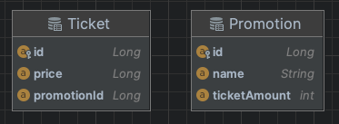

# 분산락은 Tx commit 이후에 락을 해제하자.

1. `트랜잭션 커밋 -> 락 해제` 을 권장하는 이유: 동시성 환경에서 데이터 정합성을 위함이다.
2. `락 해제 -> 트랜잭션 커밋`: 선행 트랜잭션의 내용이 반영되지 않고 후행 트랜잭션 내용만 반영되는  `second lost updates problem` 문제가 발생할 수 있다. 

## 1. 도메인 구성



`Promotion`

```java
@Entity
@Getter
@ToString
@NoArgsConstructor(access = AccessLevel.PROTECTED)
public class Promotion {

    @Id
    @GeneratedValue(strategy = GenerationType.IDENTITY)
    private Long id;

    @Getter
    @Column(length = 100, nullable = false)
    private String name;

    @OneToMany(mappedBy = "promotion", cascade = {CascadeType.ALL})
    private List<Ticket> tickets = new ArrayList<>();

    @Column(length = 20, nullable = false)
    private int ticketAmount;

    public Promotion(final String name, final int ticketAmount) {
        this.name = name;
        this.ticketAmount = ticketAmount;
    }

    public void addTicket(final Ticket ticket) {
        tickets.add(ticket);
        ticket.setPromotion(this);
    }

    public boolean soldOut() {
        return remainingTickets() <= 0;
    }

    public int remainingTickets() {
        return ticketAmount - this.tickets.size();
    }

}
```

`Ticket`

```java
@Entity
@NoArgsConstructor(access = AccessLevel.PROTECTED)
public class Ticket {

    @Id
    @GeneratedValue(strategy = GenerationType.IDENTITY)
    private Long id;

    @Column(length = 15, nullable = false)
    private Long price;

    @ManyToOne(fetch = FetchType.LAZY, cascade = CascadeType.ALL)
    @JoinColumn(name = "promotion_id")
    @Setter
    private Promotion promotion;

    public Ticket(final Long price) {
        this.price = price;
    }

}

```

## 2. JMeter 를 이용한 테스트

1. **/v1/promotions/{promotionId}/ticket** : `@Transactional`
2. **/v2/promotions/{promotionId}/ticket** :` rLock.unlock()`-> `@Transactional commit`
3. **/v3/promotions/{promotionId}/ticket** : `@Transactional commit` -> `rLock.unlock()`

### 1. ticketAmount, user 100개 동일하게 세팅

1. thread condition

    

2. 100개 HTTP Requests
   1. `@Transactional` : 100 개 Ticket 생성 (Ticket 생성 누락 X)
      - <u>하지만 HttpResponse 에서 잔여 티켓 갯수가 일치하지 않음. (DB : 100개, HttpResponse : 99개)</u>
      - 동시 요청 처리 과정에서 insert 동작 시점 차이에 따라 티켓 갯수 조회 갯수가 다르게 조회될 수 있다. 즉, 데이터 정합성이 깨지는 경우가 발생한다.
      - 최종 추가되는 티켓 수는 100개는 맞다.
   2. ` rLock.unlock()`-> `@Transactional commit` : 100 개 Ticket 생성 (Ticket 생성 누락 X)
      - <u>하지만 HttpResponse 에서 잔여 티켓 갯수가 일치하지 않음. (DB : 100개, HttpResponse : 99개)</u>
      - 동시 요청 처리 과정에서 insert 동작 시점 차이에 따라 티켓 갯수 조회 갯수가 다르게 조회될 수 있다. 1번과 동일하게 데이터 정합성을 위반하는 경우가 발생한다.
      - 커밋하기 이전에 락을 해제할 경우, 다른 트랜잭션이 참여하여 1번과 유사한 상황이 발생하는 동시성 이슈가 발생할 수 있다.
      - 최종 추가되는 티켓 수는 100개는 맞다. 
   3. `@Transactional commit` -> `rLock.unlock()` :  100 개 Ticket 생성 (Ticket 생성 누락 X)
      - 분산 락을 통해 동시성 이슈를 해결할 수 있어 사용자 요청 순으로 차례대로 티켓 갯수가 줄어든다.

### 2. ticketAmount, user 200, 500, 1000, 2000, 3000개 동일하게 세팅

- number of threads(users) 만 증가하여 테스트 진행
- 100 개 요청 테스트와 동일한 결과 확인

### 3. ticketAmount, user 5000개부터 Ticket 부정합성 발생

1. `@Transactional` insert Ticket : 4319 / 5000 (619건 누락)
2. ` rLock.unlock()`-> `@Transactional commit` insert Ticket : 4128 / 5000 (872건 누락)
3. `@Transactional commit` -> `rLock.unlock()` insert Ticket : 4080 / 5000 (920건 누락/ elapsed time : 2min 44sec)

- 결론 : 해당 테스트는 5000건의 요청 중 버려지는 요청이 있어 발생한 결과로 예측
 


- [[Redisson] What is a Java distributed lock?](https://redisson.org/glossary/java-distributed-lock.html)
- [[kurly tech blog] 풀필먼트 입고 서비스팀에서 분산락을 사용하는 방법 - Spring Redisson](https://helloworld.kurly.com/blog/distributed-redisson-lock/)
