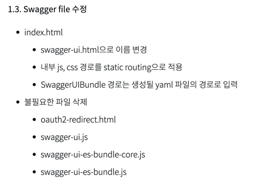
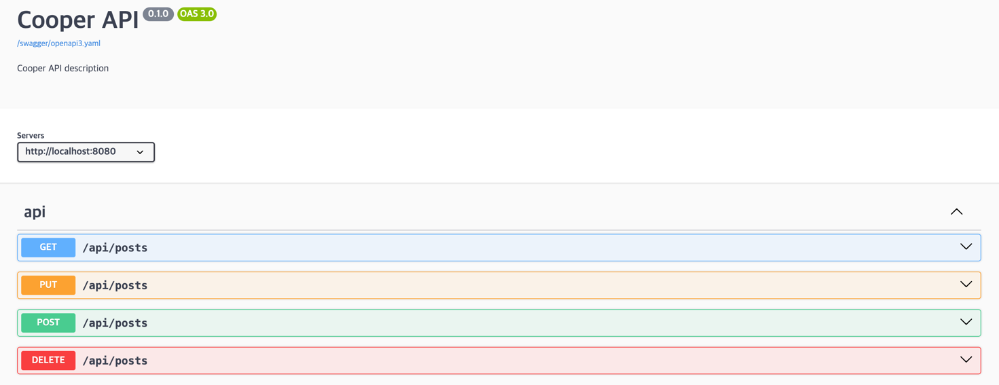

# Spring REST Docs with Swagger

## swagger vs Spring Rest Docs

1. swagger 를 통한 문서화
   - 장점
     - UI 가 깔끔하고 문서화를 사용하기 편리하다.
     - 테스트 해볼 수 있는 기능과 같은 편리한 기능을 제공한다.
   - 단점
     - 테스트없이 문서화가 가능해 로직에 대한 신뢰성을 보장하지 않는다.
     - 운영 코드에 문서화 관련 코드가 침투하여 가독성이 떨어진다.
2. Spring REST DOCS
   - 장점
     - 테스트를 기반한 문서화이므로 로직의 신뢰성을 보장한다.
   - 단점
     - 커스터마이징에 한계가 있고 문서화에서 제공하는 기능이 제한적이다.

## Spring REST Docs with Swagger
- Spring REST Docs 와 Swagger 의 장점을 모두 활용할 수 있는 것이 장점이다.

## 사용 방법

### 1. library dependency 추가

```groovy
dependencies {
    testImplementation 'org.springframework.restdocs:spring-restdocs-mockmvc'
    asciidoctorExtensions 'org.springframework.restdocs:spring-restdocs-asciidoctor'
    testImplementation 'com.epages:restdocs-api-spec-mockmvc:0.19.2'
    implementation 'org.springdoc:springdoc-openapi-ui:1.8.0'
}

```

### 2. swagger-ui 관련 정적 파일 추가

- link : https://github.com/swagger-api/swagger-ui/releases/tag/v5.13.0
- 제거 파일 (출처 : [kakao tech blog](https://tech.kakaopay.com/post/openapi-documentation/))




- 설정된 html swagger-ui.html 파일 (출처 : [kurly tech blog](https://helloworld.kurly.com/blog/spring-rest-docs-guide/))

```html
<!-- HTML for static distribution bundle build -->
<!DOCTYPE html>
<html lang="en">

<head>
  <meta charset="UTF-8">
  <title>Swagger UI for Spring REST Docs 작성 가이드</title>
  <link rel="stylesheet" type="text/css" href="/swagger-ui/swagger-ui.css">
  <link rel="icon" type="image/png" href="/swagger-ui/favicon-32x32.png" sizes="32x32" />
  <link rel="icon" type="image/png" href="/swagger-ui/favicon-16x16.png" sizes="16x16" />
  <style>
    html {
      box-sizing: border-box;
      overflow: -moz-scrollbars-vertical;
      overflow-y: scroll;
    }

    *,
    *:before,
    *:after {
      box-sizing: inherit;
    }

    body {
      margin: 0;
      background: #fafafa;
    }
  </style>
</head>

<body>
<div id="swagger-ui"></div>

<script src="/swagger-ui/swagger-ui-bundle.js" charset="UTF-8"> </script>
<script src="/swagger-ui/swagger-ui-standalone-preset.js" charset="UTF-8"> </script>
<script>
  window.onload = function () {
    // Begin Swagger UI call region
    const ui = SwaggerUIBundle({
      url: "/swagger/openapi3.yaml",
      dom_id: '#swagger-ui',
      deepLinking: true,
      presets: [
        SwaggerUIBundle.presets.apis,
        SwaggerUIStandalonePreset
      ],
      plugins: [
        SwaggerUIBundle.plugins.DownloadUrl
      ],
      layout: "StandaloneLayout"
    })
    // End Swagger UI call region

    window.ui = ui
  }
</script>
</body>

</html>

```

### 3. 정적 파일 path 설정

```java
import org.springframework.context.annotation.Configuration;
import org.springframework.web.servlet.config.annotation.ResourceHandlerRegistry;
import org.springframework.web.servlet.config.annotation.WebMvcConfigurer;

@Configuration
public class WebConfig implements WebMvcConfigurer {
	@Override
	public void addResourceHandlers(final ResourceHandlerRegistry registry) {
		registry.addResourceHandler("/static/**").addResourceLocations("classpath:/static/");
		registry.addResourceHandler("swagger-ui.html").addResourceLocations("classpath:/static/swagger-ui/");
	}
}
```

### 4. 테스트 코드 변경

- `MockMvcRestDocumentation` → `MockMvcRestDocumentationWrapper` 변경


### 5. build.gradle 변경 및 bulid test

- bootJar 과정에서 정적 파일과 문서화 파일이 구성되도록 설정
- openapi3 task bootJar 이전 시점에 실행하도록 구성

```groovy
plugins {
    id 'java'
    id 'org.springframework.boot' version '3.2.4'
    id 'io.spring.dependency-management' version '1.1.4'
    id 'org.asciidoctor.jvm.convert' version '3.3.2'
    id 'com.epages.restdocs-api-spec' version '0.18.2'
}

group = 'com.cooper'
version = '0.0.1-SNAPSHOT'

java {
    sourceCompatibility = '17'
}

configurations {
    asciidoctorExtensions
    compileOnly {
        extendsFrom annotationProcessor
    }
}

repositories {
    mavenCentral()
}

ext {
    set('snippetsDir', file("build/generated-snippets"))
}

dependencies {
    implementation 'org.springframework.boot:spring-boot-starter-web'
    testImplementation 'org.springframework.boot:spring-boot-starter-test'
    testImplementation 'org.springframework.restdocs:spring-restdocs-mockmvc'
    asciidoctorExtensions 'org.springframework.restdocs:spring-restdocs-asciidoctor'
    compileOnly 'org.projectlombok:lombok'
    annotationProcessor 'org.projectlombok:lombok'
    testImplementation 'com.epages:restdocs-api-spec-mockmvc:0.19.2'
    implementation 'org.springdoc:springdoc-openapi-ui:1.8.0'
}

openapi3 {
    server = 'http://localhost:8080'
    title = 'Cooper API'
    description = 'Cooper API description'
    // tagDescriptionsPropertiesFile = 'src/docs/tag-descriptions.yaml'
    version = '0.1.0'
    format = 'yaml'
}

tasks.named('test') {
    outputs.dir snippetsDir
    useJUnitPlatform()
}

tasks.named('asciidoctor') {
    configurations 'asciidoctorExtensions'
    baseDirFollowsSourceFile()
    inputs.dir snippetsDir
    dependsOn test
}

bootJar {
    from("${asciidoctor.outputDir}") {
        into "BOOT-INF/classes/static/docs"
    }
    from("swagger-ui") {
        into "BOOT-INF/classes/static/swagger"
    }
    from("build/api-spec") {
        into "BOOT-INF/classes/static/swagger"
    }
    dependsOn('openapi3') // openapi3 실행하고 이후에 bootJar 실행

    archiveFileName.set "application-" + getVersion() + ".jar"
}

```

### 6. 테스트 및 확인


