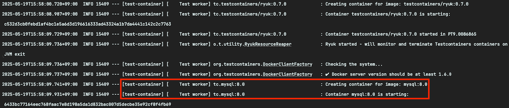

# spring-test-container


## 1. Test Container 를 사용하는 이유

1. **실제 서비스와 동일한 환경** : Docker 를 사용해 외부 시스템을 실제 운영 환경와 유사한 환경에서 테스트할 수 있다.
2. **테스트 독립성 보장** : 각 테스트를 독립된 컨테이너에서 실행되므로 테스트 고립성을 보장할 수 있다.

<br>

## 2. 테스트 컨테이너 구성 방법 (with.gradle)

```gradle
ext {
    set('testcontainers.version', "1.19.8")
}


dependencies {
    testImplementation("org.springframework.boot:spring-boot-testcontainers")
    testImplementation("org.testcontainers:junit-jupiter")
    testImplementation("org.testcontainers:mysql")
}
```

<br>

## 3. 테스트 컨테이너 생성 방법

테스트 컨테이너를 사용하기 위해서는 `@TestContainers`, `@Container` 가 필요하다.

1. `@TestContainers`
    - 해당 테스트 클래스가 TestContainers 를 사용할 것을 선언하는 클래스 레벨 어노테이션(ElementType.TYPE)이다.
    - 해당 어노테이션이 분은 클래스에서 선언된 @Container 필드의 생명 주기를 관리하며, 테스트 시작 시 컨네이너를 자동으로 시작하고, 테스트 종료 시 정리를 수행한다. 
    - TestContainer 를 사용하는 모든 테스트 클래스에 반드시 선언해야 한다.
2. `@Container` 
   - 테스트에서 사용할 컨테이너를 정의하는 어노테이션이다. 
   - 해당 필드가 TestcContainers 가 관리하는 컨테이너임을 나타내며 멤버 변수 레벨(ElementType.FIELD) 이다. 
   - @Container 로 기본적으로 선언된 컨테이너틑 테스트 시작 시 자동 생성, 종료 시 자동 정리된다. 
   - 컨테이너를 static 으로 선언하면, 테스트 클래스의 모든 메서드가 같은 컨테이너를 공유한다.

```java
import org.springframework.context.annotation.Configuration;
import org.springframework.test.context.DynamicPropertyRegistry;
import org.springframework.test.context.DynamicPropertySource;
import org.testcontainers.containers.MySQLContainer;
import org.testcontainers.junit.jupiter.Container;
import org.testcontainers.junit.jupiter.Testcontainers;
import org.testcontainers.utility.DockerImageName;

import jakarta.annotation.PreDestroy;

@Testcontainers
@Configuration
public class RdbTestContainerConfig {

	@Container
	static MySQLContainer<?> MYSQL_CONTAINER = new MySQLContainer<>(DockerImageName.parse("mysql:8.0"));

	static {
		MYSQL_CONTAINER.start();
	}

	@DynamicPropertySource
	static void configureProperties(DynamicPropertyRegistry registry) {
		registry.add("spring.datasource.url", MYSQL_CONTAINER::getJdbcUrl);
		registry.add("spring.datasource.username", MYSQL_CONTAINER::getUsername);
		registry.add("spring.datasource.password", MYSQL_CONTAINER::getPassword);
	}

	@PreDestroy
	void preDestroy() {
		if (MYSQL_CONTAINER.isRunning()) {
			MYSQL_CONTAINER.stop();
		}
	}

}
```

<br>

## 4. test/resources/application.yml 설정

1. 테스트 컨테이너 전용 spring.datasource.url 과 spring.datasource.driver-class-name 을 설정해야 한다.
   - spring.datasource.url : jdbc:tc:[image:version]://[db-name]
   - spring.datasource.driver-class-name: org.testcontainers.jdbc.ContainerDatabaseDriver

```yaml
spring:
  datasource:
    url: jdbc:tc:mysql:8://concert_db # 이 부분!!
    username: root
    password: concert2025
    driver-class-name: org.testcontainers.jdbc.ContainerDatabaseDriver # 이 부분!!
```

## 5. 테스트 실행 후 콘솔 로그 확인



- 테스트 컨테이너가 정상적으로 실행됨을 확인
